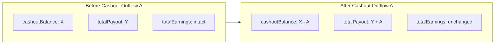

# Backend Request — Cashout Outflows Must Feed Total Payout (Never Reduce Total Earnings)

**Date:** 2026-08-07  
**From:** User FE (`mlm-user.fe`)  
**Status:** Backend shipped — FE integrating  
**Severity:** Critical  
**Area:** Dashboard overview accounting, Cashout wallet ledger, transfers, withdrawals  

**Related docs:**

- [BACKEND_REQUEST_DASHBOARD_EARNINGS_PAYOUT_FORMULA.md](./BACKEND_REQUEST_DASHBOARD_EARNINGS_PAYOUT_FORMULA.md) — original Total Payout / earnings formula (this doc **extends** the definition of `totalPayout`)
- [dashboard-endpoints-mapping.md](./dashboard-endpoints-mapping.md) — FE mapping for `GET /dashboard/overview`
- [backend-request-dashboard-transactions-voucher-filter.md](./backend-request-dashboard-transactions-voucher-filter.md) — transactions / category filters
- [BACKEND_REQUEST_FUND_TRANSFER_SAME_WALLET_TYPE.md](./BACKEND_REQUEST_FUND_TRANSFER_SAME_WALLET_TYPE.md) — cross-user fund transfer

**Related frontend:**

- Dashboard stats: `dashboard.component.ts` / `dashboard.service.ts` (`stats.totalPayout`, `stats.totalEarnings`, `stats.cashoutBalance`)
- Own-wallet transfer: `POST /wallets/transfer` (`wallet.service.ts`)
- Cross-user fund transfer: `POST /wallets/fund-transfer` (`wallet.service.ts`)
- Cash → Registration (activation path): `POST /registration/transfer-to-registration` (`registration.service.ts`)
- Transactions UI: `/transactions`, `GET /dashboard/transactions`

---

## 1. Summary

Product (client) has confirmed a non-negotiable accounting rule:

1. **`stats.totalEarnings` must never decrease.** It can only stay the same or increase.
2. **Every outflow from the Cashout (CASH) wallet must increase `stats.totalPayout`** by the same amount that Cashout decreases.
3. Users / admins must be able to **see a transfer report** for those Cashout outflows (example: username **TADEX** Cashout → Registration moves are currently invisible).

Today, fund transfers / moves from Cashout are incorrectly reducing **Total Earnings**. That is wrong and will cause disputes between users and the company.

The frontend displays overview fields as returned by the backend and **does not recompute** them. Backend is the source of truth.

---

## 2. Client requirement (source of truth)

Quoted product intent (condensed):

> Fund Transfer from Cashout is making TOTAL EARNING REPORT reduce. This is very WRONG.  
> Every transfer from CASHOUT must reflect in TOTAL PAYOUT REPORT. Total earning remains intact.  
> On no occasion should total earning reduce. It can only increase.  
> All WITHDRAWALS AND FUND TRANSFERS from CASHOUT Wallet MUST reflect in TOTAL PAYOUT.  
> Transfers from Cashout → Registration (e.g. TADEX) must appear in a transfer report and in TOTAL PAYOUT.

---

## 3. Redefined meaning of Total Payout

### Previous (narrow) definition

In [BACKEND_REQUEST_DASHBOARD_EARNINGS_PAYOUT_FORMULA.md](./BACKEND_REQUEST_DASHBOARD_EARNINGS_PAYOUT_FORMULA.md), `totalPayout` was defined as cumulative **bank withdrawals** with status `APPROVED` or `PAID` only.

### Updated (mandatory) definition

> **`stats.totalPayout`** = cumulative sum of **all successful outflows from the user's Cashout (CASH) wallet**.

Dashboard label stays **“Total Payout”**.

| Cashout outflow type | Counts toward `totalPayout`? | Endpoint / path (typical) |
|----------------------|------------------------------|---------------------------|
| Bank withdrawal (approved / paid, once) | **Yes** | `POST /withdrawals/request` + admin approve / mark-paid |
| Cross-user fund transfer **from Cashout** | **Yes** | `POST /wallets/fund-transfer` with `fromWalletType: CASH` |
| Own-wallet transfer **from Cashout** (e.g. → Registration, → Voucher, → Autoship) | **Yes** | `POST /wallets/transfer` with source `CASH` |
| Cash → Registration (activation helper) | **Yes** | `POST /registration/transfer-to-registration` |
| Rejected / failed / reversed outflow | **No** (and restore Cashout if needed) | — |
| Inflows into Cashout (commissions, funding, incoming transfers) | **No** — these may increase earnings / cashout, never payout | — |

**Important:** Money leaving Cashout for Registration (or any other wallet / user) is still a Cashout **outflow**. It must increase Total Payout even though it is not a bank payout.

---

## 4. Mandatory invariants

### 4a. Total Earnings never decreases

```text
On any Cashout outflow event:
  totalEarnings  → UNCHANGED (or only increases on new earnings credits; never decreases because of outflows)
  cashoutBalance → decreases by A
  totalPayout    → increases by A
```

### 4b. Earnings formula (unchanged structure, wider payout bucket)

```text
Total Autoship Balance
  + Total Cashout Balance
  + Total Payout
  = Total Earnings
```

API fields:

```text
hero.autoshipBalance + stats.cashoutBalance + stats.totalPayout = stats.totalEarnings
```

This formula **still holds** after redefining Total Payout as all Cashout outflows: money that left Cashout is accounted for in `totalPayout` instead of being dropped from `totalEarnings`.

### 4c. Side effects for amount `A` leaving Cashout

| Field | Change |
|-------|--------|
| `stats.totalEarnings` | **Unchanged** |
| `stats.cashoutBalance` | Decreases by `A` |
| `stats.totalPayout` | Increases by `A` |
| Destination wallet / recipient | Credited per existing transfer rules |
| `hero.autoshipBalance` | Unchanged unless destination is Autoship |



---

## 5. Observed problems

### 5a. Total Earnings decreases on Cashout fund transfer

**Actual:** Transfer / fund transfer from Cashout reduces `stats.totalEarnings`.  
**Expected:** `totalEarnings` unchanged; `totalPayout` += amount; `cashoutBalance` -= amount.

### 5b. Cashout → Registration not in Total Payout

**Actual:** Moves such as Cashout → Registration (user **TADEX**) do not increase `stats.totalPayout`.  
**Expected:** Each successful move increases `totalPayout` by the transferred amount.

### 5c. Missing transfer report

**Actual:** No visible transfer report / ledger rows for those Cashout outflows (“no transfer report”).  
**Expected:** Every successful Cashout outflow appears in user-facing (and admin-queryable) transaction / transfer history with enough detail to audit TADEX and any other user.

---

## 6. Transfer / wallet movement report (required)

Backend must expose ledger rows for **all wallet movement types** that touch Cashout outflows (at minimum), filterable and auditable.

### Minimum fields per row

| Field | Purpose |
|-------|---------|
| `id` / reference | Unique transfer or ledger id |
| `createdAt` | When it happened |
| `amount` | Positive amount moved |
| `currency` | `NGN` \| `USD` |
| `fromWalletType` | e.g. `CASH` |
| `toWalletType` | e.g. `REGISTRATION`, `VOUCHER`, or peer wallet type |
| `direction` / signed amount | Clear debit from Cashout |
| `counterparty` | Username / user id for fund transfers; self for own-wallet |
| `category` / `categoryGroup` | Stable codes FE can label (e.g. under `transfers`) |
| `status` | `SUCCESS` / failed / reversed |

### Suggested API surface (backend may adapt names)

1. Ensure existing `GET /dashboard/transactions` (and/or wallet transactions) returns these rows when filtering `category=transfers` (and ideally when browsing wallet history for Cashout).
2. If rows are missing from the ledger entirely, **persist them at transfer time** — FE cannot invent history.
3. Admin tooling (if separate) must be able to list the same events for a given username (e.g. TADEX).

### Categories that must appear (examples)

| Event | Must appear in history |
|-------|------------------------|
| `POST /wallets/fund-transfer` from CASH | Yes |
| `POST /wallets/transfer` from CASH | Yes |
| `POST /registration/transfer-to-registration` | Yes |
| Approved / paid withdrawal from CASH | Yes (existing withdrawals history + overview payout) |

---

## 7. Affected endpoints / touchpoints

| Touchpoint | Required change |
|------------|-----------------|
| `GET /dashboard/overview` | Compute `totalPayout` as sum of all successful Cashout outflows; never reduce `totalEarnings` on those events; keep formula reconciled |
| Withdrawal approve / mark-paid | Count once toward `totalPayout`; do not reduce `totalEarnings` |
| `POST /wallets/fund-transfer` (from CASH) | Debit Cashout; credit recipient; `totalPayout` += A; `totalEarnings` unchanged; write ledger row |
| `POST /wallets/transfer` (from CASH) | Same accounting + ledger row |
| `POST /registration/transfer-to-registration` | Same accounting + ledger row |
| `GET /dashboard/transactions` (and wallet history) | Return transfer rows so FE/admin can show the report |
| Reversal / reject paths | Do not leave `totalPayout` inflated; restore Cashout when appropriate |

---

## 8. Frontend contract

No FE formula change is planned for overview cards. FE continues to bind:

```typescript
// Cashout Balance → stats.cashoutBalance
// Total Earnings  → stats.totalEarnings
// Total Payout    → stats.totalPayout
```

Once ledger rows exist with a reliable `transfers` (or equivalent) filter, FE can surface a clearer Transfer History UI if product wants a dedicated page — **blocked on backend persistence + API**.

Optional later FE copy tweak (out of scope unless product asks): tooltip on Total Payout explaining it includes withdrawals **and** Cashout transfers.

---

## 9. Acceptance criteria

1. After any successful Cashout outflow of amount `A`, next `GET /dashboard/overview` shows:
   - `cashoutBalance` decreased by `A`
   - `totalPayout` increased by `A`
   - `totalEarnings` **unchanged**
2. `hero.autoshipBalance + stats.cashoutBalance + stats.totalPayout === stats.totalEarnings` (within ±0.01).
3. `totalEarnings` never decreases because of withdrawals, fund transfers, or own-wallet / registration transfers from Cashout.
4. For user **TADEX** (and any user), all Cashout → Registration transfers appear in transaction/transfer history with amount, wallets, date, and reference.
5. Cross-user fund transfers from Cashout appear in history and in `totalPayout`.
6. Withdrawals still count toward `totalPayout` exactly once (`APPROVED`/`PAID`, no double-count on mark-paid).
7. Failed / rejected / reversed outflows do not permanently inflate `totalPayout`.

---

## 10. Suggested backend test cases

| Scenario | Expected |
|----------|----------|
| Commission credited to Cashout | `totalEarnings` ↑ (or per existing earnings rules); `cashoutBalance` ↑; `totalPayout` unchanged |
| Fund transfer from Cashout amount `A` to another user | `cashoutBalance` −A; `totalPayout` +A; `totalEarnings` unchanged; ledger row exists |
| Own-wallet transfer Cashout → Registration amount `A` | Same as above; Registration credited; ledger row exists |
| `POST /registration/transfer-to-registration` amount `A` | Same accounting + ledger row |
| Withdrawal approved amount `A` | Same accounting; counted once |
| Same withdrawal marked paid | `totalPayout` unchanged (no double-count) |
| Overview after mix of withdrawals + transfers | Formula holds; `totalPayout` = sum of all successful Cashout outflows |
| History filter for transfers | TADEX (or test user) Cashout outflows all listed |

---

## 11. Relationship to prior payout formula request

This document **does not cancel** [BACKEND_REQUEST_DASHBOARD_EARNINGS_PAYOUT_FORMULA.md](./BACKEND_REQUEST_DASHBOARD_EARNINGS_PAYOUT_FORMULA.md). It **updates** section 5a’s definition of `totalPayout`:

| Topic | Prior doc | This doc |
|-------|-----------|----------|
| Formula | Keep | Keep |
| `totalEarnings` never reduced by withdrawals | Implied / required | **Explicit for all Cashout outflows** |
| What counts as payout | Withdrawals only | **All Cashout outflows** |
| Transfer visibility | Not covered | **Required** |

Please implement both: fix aggregation bugs **and** apply this wider Total Payout definition.
