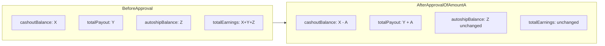

# Backend Request — Dashboard Total Payout Bug and Earnings Accounting Formula

**Date:** 2026-07-11  
**From:** User FE (`mlm-user.fe`)  
**Status:** Bug + business rule change  
**Severity:** High  
**Area:** Dashboard overview, withdrawals, earnings accounting  

**Related docs:**

- [dashboard-endpoints-mapping.md](./dashboard-endpoints-mapping.md) — frontend field mapping for `GET /dashboard/overview`
- [withdrawals-api.md](../withdrawals-api.md) — user-facing withdrawals API
- [backend-issues.md](./backend-issues.md) — Issue 2 (withdrawal approval and wallet lock conflicts)

---

## 1. Summary

Two related issues affect **`GET /dashboard/overview`**:

1. **Bug:** `stats.totalPayout` does not reflect approved or paid withdrawals. It remains at `0` even after an admin approves a user's withdrawal request.
2. **Business rule:** The backend must enforce the Total Earnings accounting formula (see Section 2 below) for every user, at all times, in their display currency.

The frontend displays these values directly on dashboard stat cards and **does not recompute them**. The backend is the single source of truth.

---

## 2. Total Earnings formula — mandatory invariant

> **Please note:** The following relationship **MUST always hold true** on `GET /dashboard/overview`. This is a non-negotiable business rule, not a frontend calculation.

### Plain-language rule

```text
Total Autoship Balance
  Plus (+)
Total Cashout Balance
  Plus (+)
Total Payout
  MUST EQUAL (=)
Total Earnings
```

### API field mapping

```text
hero.autoshipBalance + stats.cashoutBalance + stats.totalPayout = stats.totalEarnings
```

| Dashboard stat card | Role in formula |
|---------------------|-----------------|
| **Autoship Voucher** (`hero.autoshipBalance`) | Total Autoship Balance — earnings still held in the Autoship wallet |
| **Cashout Balance** (`stats.cashoutBalance`) | Total Cashout Balance — earnings still held in the Cashout (withdrawable) wallet |
| **Total Payout** (`stats.totalPayout`) | Total Payout — earnings already withdrawn (approved or paid out) |
| **Total Earnings** (`stats.totalEarnings`) | Total Earnings — lifetime earnings credited to the user (all-time total) |

### Backend reassurance required

The backend team must guarantee that:

1. **`stats.totalEarnings`** represents the user's **complete lifetime earnings** (all commissions/bonuses ever credited). It does **not** decrease when the user withdraws funds.
2. **`hero.autoshipBalance`**, **`stats.cashoutBalance`**, and **`stats.totalPayout`** together account for **100% of `stats.totalEarnings`** — nothing is missing, double-counted, or in the wrong bucket.
3. Every response from `GET /dashboard/overview` must satisfy the formula **before** it is returned to the frontend. If the values do not reconcile, the backend should fix the underlying data or calculation — not return inconsistent numbers.
4. After any withdrawal lifecycle event (request, approve, mark-paid, reject), the formula must still hold on the next overview call.

**Why this matters:** Users see these four stat cards side by side on the dashboard. If Autoship + Cashout + Payout does not equal Total Earnings, the numbers appear broken and undermine trust in the platform.

---

## 3. Dashboard field mapping

| Dashboard stat card | API field | JSON path |
|---------------------|-----------|-----------|
| Autoship Voucher | Autoship balance | `overview.hero.autoshipBalance` |
| Cashout Balance | Cashout balance | `overview.stats.cashoutBalance` |
| Total Payout | Total payout | `overview.stats.totalPayout` |
| Total Earnings | Total earnings | `overview.stats.totalEarnings` |

All money values must use the top-level `overview.currency` (`NGN` or `USD`).

---

## 4. Observed behavior (reproduction evidence)

### Live example

User: **Oluwapelumi** (Platinum package, Regional Merchant Active)

| Field | API path | Current value |
|-------|----------|---------------|
| Autoship Voucher | `hero.autoshipBalance` | ₦8,614,794.33 |
| Cashout Balance | `stats.cashoutBalance` | ₦5,873,624.38 |
| Total Payout | `stats.totalPayout` | ₦0.00 |
| Total Earnings | `stats.totalEarnings` | ₦21,649,309.71 |

**Computed sum (Autoship + Cashout + Payout):**

```text
₦8,614,794.33 + ₦5,873,624.38 + ₦0.00 = ₦14,488,418.71
```

**Gap vs Total Earnings:** ₦7,160,891.00

**Formula check (currently FAILING):**

```text
Total Autoship Balance  ₦8,614,794.33
+ Total Cashout Balance ₦5,873,624.38
+ Total Payout          ₦0.00
=                       ₦14,488,418.71   ← does NOT equal Total Earnings ₦21,649,309.71
```

This strongly suggests `stats.totalPayout` is not aggregating previously approved or paid withdrawals. The missing amount is likely cumulative payout history that should appear in `totalPayout`.

### Reproduction steps

1. User submits a withdrawal via `POST /withdrawals/request`.
2. Admin approves via `POST /admin/withdrawals/{id}/approve`.
3. User refreshes the dashboard (or navigates back to `/dashboard`).
4. Frontend calls `GET /dashboard/overview`.
5. **Actual:** `stats.totalPayout` remains unchanged (e.g. `0`).
6. **Expected:** `stats.totalPayout` includes the approved withdrawal amount, and the earnings formula holds.

---

## 5. Expected behavior

### 5a. `stats.totalPayout` calculation

| Rule | Detail |
|------|--------|
| **Definition** | Cumulative sum of all withdrawal amounts for the authenticated user where status is **`APPROVED`** or **`PAID`**. |
| **No double-counting** | Each withdrawal is counted exactly once. When a withdrawal transitions `PENDING → APPROVED → PAID`, its amount must not be added twice. |
| **Currency** | All amounts in the user's display currency (`overview.currency`), consistent with other money fields on the overview response. |
| **Excluded statuses** | Do **not** include `PENDING` or `REJECTED` withdrawals in `totalPayout`. |

**Confirmed with product:** Both `APPROVED` and `PAID` statuses count toward `totalPayout`, but a single withdrawal must never be counted more than once as it moves through the lifecycle.

### 5b. Earnings accounting formula (reinforcement)

This restates Section 2 in operational terms. Whenever `GET /dashboard/overview` is called:

```text
Total Autoship Balance + Total Cashout Balance + Total Payout = Total Earnings
```

```text
hero.autoshipBalance + stats.cashoutBalance + stats.totalPayout = stats.totalEarnings
```

**Interpretation:**

| Field | Meaning |
|-------|---------|
| `totalEarnings` | Lifetime commission/earnings credited to the user (all-time total). Does **not** decrease when the user withdraws. |
| `autoshipBalance` | Remaining earnings held in the Autoship Voucher wallet. |
| `cashoutBalance` | Remaining earnings held in the Cashout (withdrawable) wallet. |
| `totalPayout` | Earnings already withdrawn (approved or paid out to the user's bank). |

### 5c. Side effects when a withdrawal is approved

When admin approves a withdrawal of amount `A`:

| Field | Change |
|-------|--------|
| `stats.totalEarnings` | **Unchanged** (lifetime total) |
| `stats.cashoutBalance` | Decreases by `A` |
| `stats.totalPayout` | Increases by `A` |
| `hero.autoshipBalance` | **Unchanged** (cash withdrawals do not affect autoship) |



When admin marks the same withdrawal as paid (`POST /admin/withdrawals/{id}/mark-paid`):

- `stats.totalPayout` must **not** increase again (already counted at approve step).
- Other formula fields remain consistent.

When admin rejects a pending withdrawal:

- `stats.totalPayout` must **not** change.
- If the withdrawal amount was reserved from `cashoutBalance` at request time, restore `cashoutBalance` accordingly.

---

## 6. Affected endpoints and backend touchpoints

| Endpoint | Required change |
|----------|-----------------|
| `GET /dashboard/overview` | Fix `stats.totalPayout` aggregation; ensure all four formula fields reconcile |
| `POST /admin/withdrawals/{id}/approve` | Update cumulative payout total used by overview; debit cashout wallet |
| `POST /admin/withdrawals/{id}/mark-paid` | Do not double-count amount already included at approve step |
| `POST /admin/withdrawals/{id}/reject` | Do not affect `totalPayout`; restore `cashoutBalance` if amount was reserved |

**Note:** [backend-issues.md](./backend-issues.md) Issue 2 documents existing problems with withdrawal approval and wallet lock state. Fixing payout totals must not regress that flow.

---

## 7. Frontend contract (no FE changes required)

The frontend reads overview fields directly in `dashboard.component.ts` (`buildStatCardConfigs()`):

```typescript
// Autoship Voucher  → hero.autoshipBalance
// Cashout Balance    → stats.cashoutBalance
// Total Earnings     → stats.totalEarnings
// Total Payout       → stats.totalPayout
```

Reference type in `dashboard.service.ts`:

```typescript
export type DashboardOverview = {
  currency: 'NGN' | 'USD';
  hero: {
    totalWalletBalance: number;
    voucherBalance: number;
    autoshipBalance: number;
  };
  stats: {
    cashoutBalance: number;
    totalEarnings: number;
    totalPayout: number;
    productVoucher: number;
    totalDownlines: number;
    directSuccesslines?: number;
    totalCpvs: number;
  };
};
```

Per [dashboard-endpoints-mapping.md](./dashboard-endpoints-mapping.md): **do not recompute any dashboard card values on frontend.**

---

## 8. Example response (after fix)

For a user where the formula holds, `GET /dashboard/overview` should return something like:

```json
{
  "currency": "NGN",
  "hero": {
    "totalWalletBalance": 65769737.02,
    "voucherBalance": 6252801.01,
    "autoshipBalance": 8614794.33
  },
  "stats": {
    "cashoutBalance": 5873624.38,
    "totalEarnings": 21649309.71,
    "totalPayout": 7160891.00,
    "productVoucher": 6252801.01,
    "totalDownlines": 33,
    "directSuccesslines": 9,
    "totalCpvs": 594.23
  }
}
```

**Verification:**

```text
8614794.33 + 5873624.38 + 7160891.00 = 21649309.71 ✓
```

*(Payout value is illustrative — backend should compute the actual cumulative approved/paid withdrawal total.)*

---

## 9. Acceptance criteria

1. After admin approves a withdrawal of amount `A`, the next `GET /dashboard/overview` returns `stats.totalPayout` increased by `A` (if not already counted).
2. After mark-paid, `stats.totalPayout` is unchanged (no double-count).
3. **Total Earnings formula (mandatory):** For any user at any time:
   ```text
   Total Autoship Balance + Total Cashout Balance + Total Payout = Total Earnings
   ```
   i.e. `hero.autoshipBalance + stats.cashoutBalance + stats.totalPayout === stats.totalEarnings` (within acceptable rounding, e.g. ±0.01).
4. For the Oluwapelumi example user, after fix, the four values must reconcile.
5. All amounts use `overview.currency` — no mixed USD/NGN units (see [backend-issues.md](./backend-issues.md) Issue 4).

---

## 10. Suggested backend test cases

| Scenario | Expected outcome |
|----------|------------------|
| **Any overview call** | **Total Autoship + Total Cashout + Total Payout = Total Earnings** (always) |
| User with zero withdrawals | Formula holds; `totalPayout = 0` |
| User submits withdrawal (pending) | Formula holds; `totalPayout` unchanged |
| Admin approves withdrawal of `A` | `totalPayout` += `A`, `cashoutBalance` -= `A`, `totalEarnings` unchanged |
| Admin marks same withdrawal paid | `totalPayout` unchanged (no double-count) |
| Admin rejects pending withdrawal | `totalPayout` unchanged; `cashoutBalance` restored if reserved |
| Multiple withdrawals (APPROVED, PAID, REJECTED mix) | Sum only APPROVED + PAID once each |
| NGN user | All formula fields in NGN |

---

## 11. Optional frontend follow-up (out of scope)

If the backend fix is delayed, the frontend could optionally re-fetch `GET /dashboard/overview` when a `WITHDRAWAL_APPROVED` or `WITHDRAWAL_PAID` notification arrives. This is a UX improvement only; the root fix is backend-side.
