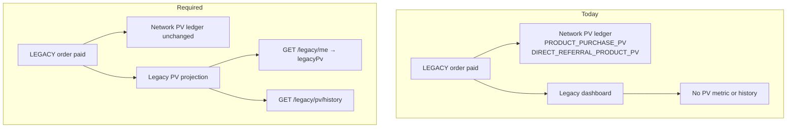

# Backend Request: Legacy PV Dashboard (Summary + History)

**Date:** 2026-09-23  
**From:** User FE (`mlm-user.fe`)  
**Status:** Shipped — FE integrated (2026-09-24)  
**Severity:** High  
**Area:** Legacy marketplace PV visibility (`GET /legacy/me`, new PV history)

**Related docs:**

- **FE integration (shipped):** [`frontend-integration-legacy-pv-dashboard.md`](./frontend-integration-legacy-pv-dashboard.md)
- Product volume / PV ledger: [`frontend-integration-product-volume-distribution.md`](./frontend-integration-product-volume-distribution.md)
- Earnings activity (network PV): [`earnings-activity-log.md`](./earnings-activity-log.md)
- Legacy checkout: [`legacy-checkout.service.ts`](../src/app/services/legacy-checkout.service.ts) (via `channel: LEGACY`, `LEGACY_VOUCHER` pay)
- Legacy home: [`legacy-home.component.ts`](../src/app/pages/legacy-club/legacy-home/legacy-home.component.ts)
- Membership history (not shop PV): [`legacy-history.component.ts`](../src/app/pages/legacy-club/legacy-history/legacy-history.component.ts)

---

## Summary

Members who buy on the **Legacy marketplace** (`channel: LEGACY`, pay with `LEGACY_VOUCHER`) expect to see **Product Volume (PV)** on the Legacy dashboard:

1. A **PV total** box on Legacy home — Legacy PV accumulated through Legacy activity
2. A **PV history** — own purchases (“I bought X, I got Y PV”) and direct-referral credits (“You got Y PV from @downline’s purchase of …”)

**Reported issue:** After checkout (e.g. ₦15,000 × 2 = ₦30,000), PV may credit **network** totals but nothing appears on the Legacy dashboard. Members cannot confirm Legacy PV was earned.

**Product rule:** Legacy PV must still **roll up to the member’s main network PV** (same underlying credits as today). Legacy endpoints are a **Legacy-channel-filtered view**, not a separate PV economy.

**Trigger:** Same as network product PV — on **Legacy order paid** (wallet pay success / `order.paid`).

---

## Scope

| In scope | Out of scope |
|----------|----------------|
| Legacy marketplace orders (`channel: LEGACY`) | Network shop orders (`channel: NETWORK` or default) |
| Buyer personal product PV (`pv × qty` per item) | Changing network milestone / CPV math |
| Direct sponsor product PV (`directReferralPv × qty`) | Community / matrix CPV rows on Legacy UI (optional later) |
| Join / upgrade / reactivate checkout when paid with `LEGACY_VOUCHER` | Membership history (`GET /legacy/history` JOIN/UPGRADE rows) |

---

## Current vs required behavior



---

## API 1: PV summary on Legacy home

**Recommendation:** Extend **`GET /legacy/me`** with a `legacyPv` block (one bootstrap call for Legacy home).

```json
{
  "status": "ACTIVE",
  "currency": "NGN",
  "legacyCashout": { "balance": 80000, "status": "ACTIVE" },
  "legacyVoucher": { "balance": 12000, "status": "ACTIVE" },
  "legacyPv": {
    "totalPv": 450,
    "personalProductPv": 300,
    "directReferralProductPv": 150
  }
}
```

| Field | Type | Meaning |
|-------|------|---------|
| `legacyPv.totalPv` | number | All Legacy-channel product PV credited to this member |
| `legacyPv.personalProductPv` | number | Buyer PV from own paid Legacy orders: `Σ (item.pv × item.quantity)` |
| `legacyPv.directReferralProductPv` | number | Sponsor PV from direct downline Legacy purchases: `Σ (item.directReferralPv × item.quantity)` |

**Rules:**

- Include only **paid** orders with `channel = LEGACY` (or equivalent flag on order/checkout batch).
- Use **order item snapshots** at pay time (`pv`, `directReferralPv` on each line).
- `totalPv` = `personalProductPv + directReferralProductPv` for this member as recipient.
- Totals must be **consistent** with network PV ledger entries for the same events (recomputable from shared transactions).
- If member has no Legacy PV yet, return zeros (omit block only if backward compatibility requires it; FE prefers explicit zeros).

**Alternative:** `GET /legacy/pv/summary` — acceptable if extending `/legacy/me` is undesirable; FE can add a second call.

---

## API 2: Legacy PV history

**New endpoint:** `GET /legacy/pv/history`

**Query:** `limit` (1–100, default 20), `cursor` (ISO `createdAt` of the last item from the previous page — **not** row `id`). HerbApi DTO: `legacy-pv-history-query.dto.ts`.

**Auth:** Bearer + registration paid + Legacy member (same as other `/legacy/*` member routes).

**Response:**

```json
{
  "items": [
    {
      "id": "550e8400-e29b-41d4-a716-446655440001",
      "kind": "OWN_PURCHASE",
      "pvAmount": 30,
      "at": "2026-09-23T12:00:00.000Z",
      "orderId": "order-uuid-1",
      "orderReference": "ORD-LEG-001",
      "orderTotal": 15000,
      "currency": "NGN",
      "productSummary": "Wellness Pack × 2",
      "buyerUsername": null,
      "downlineUsername": null
    },
    {
      "id": "550e8400-e29b-41d4-a716-446655440002",
      "kind": "DIRECT_REFERRAL_PURCHASE",
      "pvAmount": 15,
      "at": "2026-09-23T11:30:00.000Z",
      "orderId": "order-uuid-2",
      "orderReference": "ORD-LEG-002",
      "orderTotal": null,
      "currency": null,
      "productSummary": "Tea × 1",
      "buyerUsername": "jane_doe",
      "downlineUsername": "jane_doe"
    }
  ],
  "nextCursor": null
}
```

### Item kinds

| `kind` | Recipient | When created | Member-facing copy (FE) |
|--------|-----------|--------------|-------------------------|
| `OWN_PURCHASE` | Buyer | Buyer’s Legacy order paid | “You earned {pvAmount} PV from your purchase ({productSummary})” |
| `DIRECT_REFERRAL_PURCHASE` | Direct Legacy sponsor | Downline’s Legacy order paid | “You earned {pvAmount} PV from @downlineUsername’s purchase ({productSummary})” |

### Field notes

| Field | Required | Notes |
|-------|----------|-------|
| `id` | yes | Stable id for list key |
| `kind` | yes | `OWN_PURCHASE` \| `DIRECT_REFERRAL_PURCHASE` |
| `pvAmount` | yes | PV points for this row (integer or decimal per backend convention) |
| `at` | yes | ISO timestamp (order paid at) |
| `orderId` | yes | Links to order detail if needed |
| `orderReference` | recommended | Human-readable ref |
| `productSummary` | yes | e.g. `"Wellness Pack × 2"` or `"3 items (45 PV)"` for multi-line orders |
| `orderTotal` | OWN_PURCHASE only | Display amount buyer paid |
| `currency` | OWN_PURCHASE only | Order currency |
| `downlineUsername` | DIRECT_REFERRAL only | **Client requirement** — sponsor must see who triggered the PV |
| `buyerUsername` | DIRECT_REFERRAL only | Same as downline; include for clarity |

**Backend rules:**

- Create rows on Legacy order pay; **idempotent** on `(orderId, kind, recipientUserId)`.
- Sort **newest first**.
- Sponsor row only when buyer has an eligible **direct sponsor** (align with existing Legacy / Segulah referral rules for product PV).
- **Do not** merge into `GET /legacy/history` — that endpoint stays membership events (JOIN / UPGRADE / REACTIVATE / SEED).

**FE preference:** **One history row per order** per recipient, with aggregated `pvAmount` and a combined `productSummary` (not one row per line item).

---

## Relationship to network PV (must not regress)

On Legacy order paid, backend should continue existing network behavior:

| Recipient | Network ledger source (existing) | Legacy history kind |
|-----------|----------------------------------|---------------------|
| Buyer | `PRODUCT_PURCHASE_PV` (personal product PV; Legacy orders filtered by `channel = LEGACY`) | `OWN_PURCHASE` |
| Legacy direct sponsor | `LEGACY_DIRECT_SUCCESSLINE_PV` | `DIRECT_REFERRAL_PURCHASE` |

Legacy APIs are a **filtered projection** of Legacy-channel orders. Do **not**:

- Double-count PV in network milestone totals
- Skip network PV writes in favor of Legacy-only records

Reference: [`frontend-integration-product-volume-distribution.md`](./frontend-integration-product-volume-distribution.md) §5–6.

---

## Edge cases

| Case | Expected handling |
|------|-------------------|
| Join-package checkout (`shopMode: JOIN`) | Count — still `channel: LEGACY` |
| Upgrade / reactivate shop orders | Count if paid with `LEGACY_VOUCHER` |
| Multi-item order | One row per recipient; sum PV; combined `productSummary` |
| Zero-PV products | Omit from history (or skip row if order total PV is 0) |
| Buyer has no Legacy sponsor | Only `OWN_PURCHASE` row |
| Sponsor not ACTIVE in Legacy | No `DIRECT_REFERRAL_PURCHASE` row (match network eligibility) |
| Orders before this API ships | Optional **backfill** job from paid Legacy orders |
| Split checkout (multiple orders in one batch) | One history row per order id |

---

## Frontend usage

| Screen | Data source |
|--------|-------------|
| Legacy home — **Legacy PV** metric card | `GET /legacy/me` → `legacyPv.totalPv` (breakdown in subtitle) |
| Legacy PV history — `/legacy/pv/history` | `GET /legacy/pv/history` (ISO cursor pagination) |
| Network earnings / CPV | Unchanged — `GET /earnings/activity`, CPV history |

Full FE integration guide: [`frontend-integration-legacy-pv-dashboard.md`](./frontend-integration-legacy-pv-dashboard.md).

Receipt modal already shows order `totalPv` at checkout; dashboard uses persisted summary + history from backend.

---

## Verification checklist

- [ ] Paid Legacy shop order with known PV (e.g. 30 PV on ₦15,000 × 2) → buyer `legacyPv.personalProductPv` increases by expected amount.
- [ ] Same order → direct sponsor receives `DIRECT_REFERRAL_PURCHASE` in `GET /legacy/pv/history` with **downline username**.
- [ ] Buyer sees `OWN_PURCHASE` row with `productSummary`, `orderReference`, `pvAmount`.
- [ ] `GET /legacy/pv/history` paginates; newest first.
- [ ] Network `GET /earnings/activity` (or CPV history) still shows corresponding PV entries — **no duplicate inflation** of network totals.
- [ ] Network shop order does **not** appear in Legacy PV history or `legacyPv` totals.
- [ ] Idempotent: replaying pay webhook does not duplicate history rows.

---

## Backend action items

1. Add `legacyPv` summary to `GET /legacy/me` (or ship `GET /legacy/pv/summary`).
2. Implement `GET /legacy/pv/history` with kinds `OWN_PURCHASE` and `DIRECT_REFERRAL_PURCHASE`.
3. On Legacy order paid, write history rows + update aggregates (or compute aggregates from ledger).
4. Keep existing network PV credits (`PRODUCT_PURCHASE_PV`, `DIRECT_REFERRAL_PRODUCT_PV`).
5. Document whether community/matrix CPV from Legacy orders appears anywhere on Legacy UI later (out of scope for v1).
6. Optional: backfill history for paid Legacy orders already in production.
