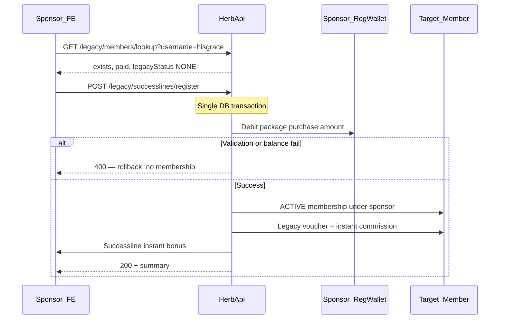

# Backend request: sponsor-paid Legacy Successline registration

**Status:** Open — frontend shipped against this contract; HerbApi endpoint pending  
**Area:** `POST /legacy/successlines/register` — register a downline into Legacy Club from the sponsor dashboard  
**Audience:** HerbApi / Legacy Club backend  
**Related FE:** [`legacy-home.component.ts`](../src/app/pages/legacy-club/legacy-home/legacy-home.component.ts), [`legacy-club.service.ts`](../src/app/services/legacy-club.service.ts)

---

## Problem

Active Legacy members can open **Register a Successline** on `/legacy/home`, look up a paid Segulah member (`Ready`), but cannot complete registration. Phase 1 spec only allowed lookup + copy username; the downline had to join on their own login.

**Product change:** Sponsors must register downlines directly — like network **Create Referral** — by debiting **their registration wallet** in one atomic call. If payment fails, the target must **not** be registered or left `PENDING_JOIN`.

### Why existing endpoints are insufficient

| Endpoint | Limitation |
|---|---|
| `GET /legacy/members/lookup` | Read-only; no payment |
| `POST /legacy/join/start` | Acts on **authenticated user**; creates `PENDING_JOIN` |
| `POST /legacy/payments/wallet` | Debits **joining user's** registration wallet; requires prior `PENDING_JOIN` |

HerbApi [`legacy-payment.repository.ts`](../../../HerbApi/src/modules/legacy-club/legacy-payment.repository.ts) debits `membership.userId`'s registration wallet during activation. Sponsor-paid registration needs a **new path** that debits the **sponsor**.

**Reference:** [`createReferralFromDashboard`](../../../HerbApi/src/modules/referrals/referrals.service.ts) — balance check + create + activate in one transaction.

---

## Product requirement

From Legacy member home → **Register someone**:

1. Sponsor looks up target username (`GET /legacy/members/lookup`).
2. When eligible, sponsor selects Legacy package (`VIP` / `EXECUTIVE` / `SUPREME`).
3. Sponsor clicks **Register & pay** — single request debits sponsor registration wallet and activates target **under sponsor**.
4. On insufficient balance or any validation failure: **no** membership row, **no** `PENDING_JOIN`, **no** ledger writes.
5. On success: target `ACTIVE`, instant commission to target Legacy cashout, Successline instant bonus to sponsor (same rules as normal join activation).

Wallet-only for v1 (no manual bank on sponsor register screen).

---

## Flow



---

## New endpoint

```http
POST /legacy/successlines/register
Authorization: Bearer <sponsor>
Content-Type: application/json
```

### Request body

```json
{
  "username": "hisgrace",
  "package": "VIP",
  "requestKey": "550e8400-e29b-41d4-a716-446655440000"
}
```

| Field | Rules |
|---|---|
| `username` | Target Segulah member; trim; case-insensitive lookup |
| `package` | `VIP` \| `EXECUTIVE` \| `SUPREME`; must be active in config |
| `requestKey` | UUID; idempotency (same pattern as `POST /legacy/payments/wallet`) |

### Guards

- `JwtAuthGuard`
- `RegistrationPaidGuard`
- `BlockImpersonationGuard`
- Caller must have **ACTIVE** Legacy membership (`NOT_LEGACY_MEMBER` otherwise)

### Pre-transaction validation

1. **Target exists** → else `TARGET_NOT_FOUND`
2. **Target `isRegistrationPaid`** → else `TARGET_NOT_PAID`
3. **Target Legacy status is `NONE`** (no membership row, or equivalent) → reject:
   - `ACTIVE` → `ALREADY_IN_LEGACY`
   - `PENDING_JOIN` → `ALREADY_PENDING` (do not complete someone else's pending join from this endpoint in v1)
4. **Sponsor eligibility** — reuse [`resolveLegacySponsor`](../../../HerbApi/src/modules/legacy-club/legacy-sponsor.util.ts):
   - `joiningUserId` = target user id
   - `chosenUsername` = authenticated sponsor username
   - Resolved sponsor **must equal** authenticated user
   - Failures: `SPONSOR_MUST_BE_AUTO`, `SPONSOR_NOT_LEGACY`, etc.
5. **Package config active** → `PACKAGE_INACTIVE`
6. **Sponsor registration wallet** — exists, `ACTIVE`, balance ≥ `purchaseAmountNgn` → `INSUFFICIENT_BALANCE` / `WALLET_LOCKED`

No transaction PIN (align with [`BACKEND_BUG_LEGACY_WALLET_PAYMENT_NO_PIN.md`](./BACKEND_BUG_LEGACY_WALLET_PAYMENT_NO_PIN.md)).

### Atomic transaction (recommended)

New service method e.g. `registerSuccesslineFromDashboard(sponsor: User, dto)` in [`legacy-club.service.ts`](../../../HerbApi/src/modules/legacy-club/legacy-club.service.ts), one Prisma `$transaction`, reusing helpers from [`legacy-payment.repository.ts`](../../../HerbApi/src/modules/legacy-club/legacy-payment.repository.ts):

1. `SELECT … FOR UPDATE` on sponsor registration wallet
2. Re-check balance ≥ package `purchaseAmountNgn`
3. Create `LegacyMembership` **directly as `ACTIVE`** with `legacySponsorId` = sponsor, `sponsorSource` AUTO or CHOSEN — **do not** insert `PENDING_JOIN`
4. Create approved `LegacyPayment` (`purpose: JOIN`, `method: REGISTRATION_WALLET`); store `paidByUserId: sponsor.id` in metadata or dedicated column for audit
5. **Debit sponsor** registration wallet (`LedgerSource` e.g. `LEGACY_SPONSOR_REGISTER` or `LEGACY_JOIN` with `{ paidForUserId }` metadata)
6. **Credit target** Legacy product voucher (full purchase amount)
7. **Credit target** instant membership commission (Legacy cashout ledger)
8. **Credit sponsor** Successline instant bonus (% of instant commission — same as join activation ~519–535 in payment repo)
9. Create cycle, `LegacyMembershipEvent` (`JOIN`), ensure target `LEGACY_VOUCHER` wallet exists
10. Commit; any failure rolls back entirely

### Success response (200)

```json
{
  "status": "success",
  "data": {
    "username": "hisgrace",
    "package": "VIP",
    "legacyStatus": "ACTIVE",
    "sponsorUsername": "dele1a",
    "sponsorSource": "AUTO",
    "joinedAt": "2026-09-24T10:30:00.000Z",
    "instantCommission": 20000,
    "successlineBonus": 2000,
    "currency": "NGN"
  }
}
```

### Error codes

| HTTP | Code | When |
|---|---|---|
| 400 | `TARGET_NOT_FOUND` | Username unknown |
| 400 | `TARGET_NOT_PAID` | Not a paid Segulah member |
| 400 | `ALREADY_IN_LEGACY` | Target already ACTIVE |
| 400 | `ALREADY_PENDING` | Target has unpaid `PENDING_JOIN` |
| 400 | `SPONSOR_MUST_BE_AUTO` | Target must join under Segulah sponsor, not caller |
| 403 | `NOT_LEGACY_MEMBER` | Caller not ACTIVE Legacy member |
| 400 | `SPONSOR_NOT_LEGACY` | Chosen sponsor not active (internal) |
| 400 | `PACKAGE_INACTIVE` | Package unavailable |
| 400 | `INSUFFICIENT_BALANCE` | Sponsor registration wallet too low |
| 400 | `WALLET_LOCKED` | Sponsor registration wallet locked |
| 403 | `IMPERSONATION_ACTION_BLOCKED` | Impersonation session |
| 409 | `DUPLICATE_REQUEST_KEY` | Idempotent replay |

Use existing `ApiError.badRequest(code, message)` pattern for structured `code` in JSON body.

---

## Optional: extend member lookup

When caller is ACTIVE Legacy member, enrich `GET /legacy/members/lookup`:

```json
{
  "username": "hisgrace",
  "exists": true,
  "isRegistrationPaid": true,
  "legacyStatus": "NONE",
  "canRegisterUnderMe": true,
  "sponsorSourceIfRegistered": "AUTO"
}
```

When `canRegisterUnderMe: false`, include `blockCode` (e.g. `SPONSOR_MUST_BE_AUTO`) so FE can block before package selection.

---

## HerbApi touchpoints

| File | Change |
|---|---|
| `legacy-club.controller.ts` | `POST successlines/register` route |
| `legacy-club.service.ts` | `registerSuccesslineFromDashboard()` |
| `legacy-payment.repository.ts` | Shared activation / ledger helpers; sponsor debit variant |
| `dto/` | `RegisterLegacySuccesslineDto` |
| `legacy-sponsor.util.ts` | Reuse `resolveLegacySponsor` (no change if used as-is) |

---

## Frontend (shipped)

- `LegacyClubService.registerSuccessline()` → `POST legacy/successlines/register`
- Register modal on `/legacy/home`: package picker, registration wallet balance, **Register & pay**, fund-wallet link
- Mock store implements atomic debit + successline list update for local dev

---

## Test plan (backend)

1. Sponsor ACTIVE, target eligible, sufficient balance → target ACTIVE, sponsor wallet debited, bonuses posted
2. Insufficient balance → 400, no membership, no ledger
3. Target already ACTIVE → `ALREADY_IN_LEGACY`
4. Target `PENDING_JOIN` → `ALREADY_PENDING`
5. Caller not target's allowed Legacy sponsor → `SPONSOR_MUST_BE_AUTO`
6. Duplicate `requestKey` → idempotent 200 or 409 per existing wallet-pay convention
7. Impersonation → blocked
