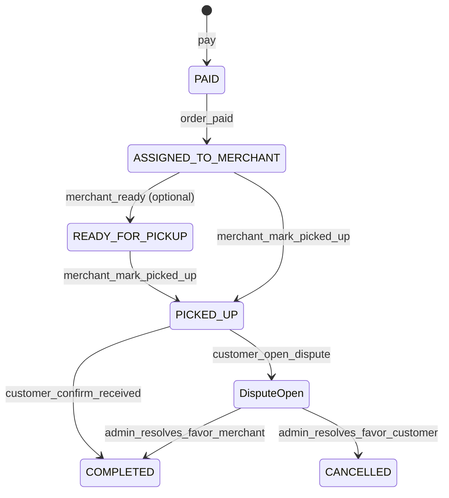

# Frontend Integration — Customer Checkout, Merchant Selection & Pickup Disputes

**Requirement 4 of 5**
**Date:** 2026-07-02
**Status:** **Shipped**
**Audience:** Customer app + admin app

Related:

- [frontend-integration-merchant-stock-dispatch.md](./frontend-integration-merchant-stock-dispatch.md) — merchant stock dispatch & disputes (Requirement 3)
- [PICKUP_MERCHANTS_BY_STATE_API.md](../Febugs/PICKUP_MERCHANTS_BY_STATE_API.md) — merchant discovery by state

---

## 1. Overview

Customers now:

1. Pick a canonical **country and state/region at checkout** and see all active merchants that
   cover that location (never hidden by stock).
2. Get a **per-product stock guidance** so the UI can grey out merchants that lack a product and suggest alternatives or admin delivery.
3. **Split** a cart across multiple merchants and/or an admin delivery group in a single checkout.
4. Track a PICKUP order through a **handoff** flow: merchant marks it picked up, customer confirms receipt (or opens a dispute).
5. Open an **order dispute** that an admin mediates.



---

## 2. Merchant discovery

### 2a. `GET /merchants/available`

Bearer + registration paid. Query: required `countryCode`, `subdivisionCode`, and canonical
`state` display text; optional `productId` and `quantity` (default 1).

**Breaking change:** merchants are **no longer hidden** when they lack the requested product. Every active merchant that serves the state is returned. Use the new per-product flags to render stock state.

**Response (per merchant):**

```json
{
  "merchants": [
    {
      "id": "uuid",
      "username": "Merchant A",
      "phoneNumber": "080...",
      "address": "...",
      "locations": [
        {
          "countryCode": "NG",
          "subdivisionCode": "LA",
          "country": "Nigeria",
          "state": "Lagos",
          "address": "...",
          "phoneNumber": "080..."
        }
      ],
      "locationsComplete": true,
      "usingPrimaryAddressFallback": false,
      "serviceAreas": ["Lagos"],
      "coversState": true,
      "products": [
        { "id": "uuid", "name": "Wine", "sku": "W-1", "stockQuantity": 5, "inStock": true }
      ],
      "requestedProductInStock": true,
      "pickupAvailable": true
    }
  ]
}
```

- `products[].inStock` is `stockQuantity >= quantity`.
- `requestedProductInStock` is `null` when no `productId` is passed, otherwise `true`/`false` for that merchant.

### 2b. `POST /merchants/checkout/availability`

Validates a whole cart against a state without creating orders. Bearer + registration paid.

**Request:**

```json
{
  "countryCode": "NG",
  "subdivisionCode": "LA",
  "state": "Lagos",
  "items": [
    { "productId": "uuid", "quantity": 2 },
    { "productId": "uuid", "quantity": 1 }
  ],
  "selectedMerchantId": "uuid"
}
```

**Response:**

```json
{
  "merchants": [ /* same shape as GET /merchants/available */ ],
  "selectedMerchant": {
    "merchantId": "uuid",
    "canFulfillAll": false,
    "missingItems": [
      {
        "productId": "uuid",
        "quantityNeeded": 1,
        "merchantsWithStock": [
          { "merchantId": "uuid", "username": "Merchant B", "stockQuantity": 5 }
        ],
        "anyMerchantHasStock": true,
        "adminDeliveryAvailable": true
      }
    ]
  }
}
```

- `selectedMerchant` is `null` when `selectedMerchantId` is omitted.
- For each missing line: if `anyMerchantHasStock` is `true`, show the alternate merchants; otherwise offer **admin delivery** (`adminDeliveryAvailable` is always `true`).

---

## 3. Split-order checkout

### `POST /orders/checkout`

Bearer + registration paid. Creates one order per group in a single transaction; all orders share a `checkoutBatchId`.

**Request:**

```json
{
  "countryCode": "NG",
  "subdivisionCode": "LA",
  "state": "Lagos",
  "paymentMethod": "WALLET",
  "idempotencyKey": "optional",
  "groups": [
    {
      "fulfilmentMode": "PICKUP",
      "selectedMerchantId": "merchant-a",
      "items": [{ "productId": "wine", "quantity": 3 }]
    },
    {
      "fulfilmentMode": "PICKUP",
      "selectedMerchantId": "merchant-b",
      "items": [{ "productId": "wine", "quantity": 1 }]
    },
    {
      "fulfilmentMode": "OFFLINE_DELIVERY",
      "deliveryAddress": "12 Somewhere Street, Lagos",
      "deliveryDisclaimerAccepted": true,
      "items": [{ "productId": "gin", "quantity": 1 }]
    }
  ]
}
```

**Response:**

```json
{
  "checkoutId": "batch-uuid",
  "orders": [
    { "id": "order-uuid", "fulfilmentMode": "PICKUP", "selectedMerchantId": "merchant-a", "totalAmount": 120, "items": [ /* ... */ ] }
  ],
  "grandTotal": 200
}
```

- Each PICKUP group validates and reserves merchant stock; each OFFLINE_DELIVERY group requires an address (>= 10 chars) and `deliveryDisclaimerAccepted: true`.
- PICKUP groups also validate that the selected merchant serves `state`.

### Batch payment

`POST /orders/checkout/:checkoutId/pay-wallet`

Pays every unpaid order in the batch atomically (per-order wallet debits). Body: `{ "walletType": "VOUCHER" }` (optional; product purchases only accept the Product Voucher wallet).

```json
{ "message": "Checkout payment successful", "paidOrderIds": ["order-uuid", "order-uuid"] }
```

If any child order fails, that order is marked `FAILED`; the endpoint stops at the first failure. Re-calling it retries the remaining unpaid orders.

### Cancelling

`POST /orders/:id/cancel` — unpaid PICKUP orders now **restore** the reserved merchant stock.

---

## 4. PICKUP handoff

| Actor | Method | Path | Notes |
|-------|--------|------|-------|
| Merchant | `POST` | `/merchants/orders/:id/mark-ready-for-pickup` | Optional; emits `ORDER_READY_FOR_PICKUP` |
| Merchant | `POST` | `/merchants/orders/:id/mark-picked-up` | `ASSIGNED_TO_MERCHANT` or `READY_FOR_PICKUP` → `PICKED_UP`; emits `ORDER_PICKED_UP` |
| Customer | `POST` | `/orders/:id/confirm-received` | Requires `PICKED_UP` and no open dispute → `COMPLETED` |

**Important:** for PICKUP, the merchant `confirm-delivery` endpoint is rejected — completion must come from the customer confirming receipt (or admin dispute resolution).

---

## 5. Order disputes

### Customer

`POST /orders/:id/disputes` — `multipart/form-data`. Allowed when the order is `PICKED_UP` and not yet `COMPLETED`.

| Field | Type | Notes |
|-------|------|-------|
| `reason` | string | required, 3–200 chars |
| `customerNotes` | string | optional |
| `evidence` | file[] | optional, up to 10 |

Opening a dispute **blocks** `confirm-received` until it is resolved.

`GET /orders/:id/disputes` — list disputes for your order.

### Admin

Base `/admin/orders` — Bearer + admin role + RBAC.

| Method | Path | Permission | Notes |
|--------|------|------------|-------|
| `GET` | `/disputes` | `orders.view` | Filters: `status`, `merchantId`, `limit`, `offset` |
| `POST` | `/disputes/:id/resolve` | `orders.resolve_dispute` | Body below |

**Resolve body:**

```json
{ "outcome": "MERCHANT", "adminNotes": "reviewed offline", "resolution": "COMPLETE_ORDER" }
```

- `outcome: "MERCHANT"` → order `COMPLETED` (customer keeps goods as-is).
- `outcome: "CUSTOMER"` → order `CANCELLED` (handle refund offline; `resolution` records the intent).

---

## 6. Notifications

| Type | Recipient | When |
|------|-----------|------|
| `ORDER_READY_FOR_PICKUP` | Customer | Merchant marks ready |
| `ORDER_PICKED_UP` | Customer | Merchant marks picked up |
| `ORDER_RECEIVED_CONFIRMED` | Customer | Customer confirms receipt |
| `ORDER_DISPUTE_OPENED` | Customer | Dispute opened |
| `ADMIN_ORDER_DISPUTE_OPENED` | Admins | Dispute opened |
| `ORDER_DISPUTE_RESOLVED` | Customer | Admin resolves dispute |

All are category `ORDER` (except the admin one, `SYSTEM`).

---

## 7. Suggested screens

1. **Checkout geography picker** — country then state/region; pickup supports configured
   countries, while home delivery is disabled outside Nigeria until pricing exists.
2. **Merchant list** — show full, partial, and zero-stock states; partial merchants remain
   selectable so availability can resolve a split. Show the matched address/phone and a
   confirmation warning when the primary-address fallback is used.
3. **Stock conflict modal** — from `POST /merchants/checkout/availability`; per missing line show `merchantsWithStock` or a "Ship via admin" option.
4. **Split-order summary** — group items by merchant/delivery, show `grandTotal`, then `POST /orders/checkout` and `pay-wallet`.
5. **Order tracking** — `PICKED_UP` → "Confirm received" + "Open dispute" CTAs.
6. **Admin dispute inbox** — `GET /admin/orders/disputes` + resolve.

## 8. User-app implementation status

- [x] Canonical country/subdivision discovery and checkout payloads
- [x] Explicit geography loading, empty, error, and retry states
- [x] Nigeria-only home delivery with canonical Lagos/outside-Lagos fee calculation
- [x] Full/partial/none merchant stock selection and fallback-address warning
- [x] Split checkout with voucher batch payment
- [x] Force-refreshed pickup handoff, fail-closed dispute gating, and resolved history
- [x] Pickup/dispute notification types and order action links
- [ ] Admin dispute inbox and resolution UI (separate admin application)
