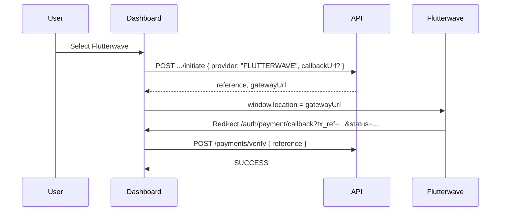
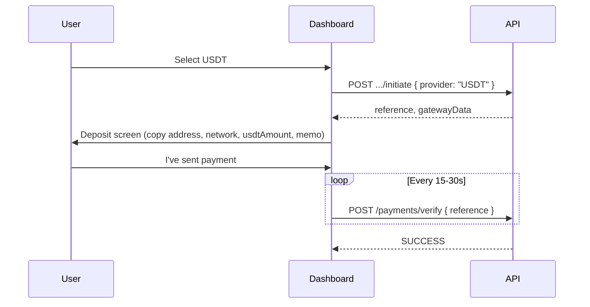

# Flutterwave & USDT (Bybit) — Frontend Integration

Dashboard changes for **Flutterwave** (fiat redirect checkout) and **USDT** (on-chain deposit via Bybit monitoring). Mirrors the existing Paystack flow where applicable.

**Backend spec:** [integration-flutterwave-bybit.md](../features/integration-flutterwave-bybit.md)

**Base URL:** `https://api.segulah.ng` (production) · `http://localhost:3000` (local)

**Auth:** All `initiate` and `verify` endpoints require `Authorization: Bearer <accessToken>`.

---

## 1. Provider enum

| Value | UX | `gatewayUrl` | `gatewayData` |
|-------|-----|--------------|---------------|
| `PAYSTACK` | Redirect to hosted checkout | Yes | No |
| `FLUTTERWAVE` | Redirect to hosted checkout | Yes | No |
| `KORAPAY` | Redirect to hosted checkout | Yes | No |
| `USDT` | Stay on deposit screen | No | Yes (required) |

### Where each provider is allowed

| Surface | Endpoint | Providers |
|---------|----------|-----------|
| Registration | `POST /payments/registration/initiate` | `PAYSTACK`, `FLUTTERWAVE`, `KORAPAY`, `USDT` |
| Package upgrade | `POST /payments/upgrade/initiate` | `PAYSTACK`, `FLUTTERWAVE`, `KORAPAY`, `USDT` |
| Voucher wallet funding | `POST /payments/wallet-funding/initiate` | `PAYSTACK`, `FLUTTERWAVE`, `KORAPAY`, `USDT` |
| Registration wallet funding | `POST /payments/registration-wallet-funding/initiate` | `PAYSTACK`, `FLUTTERWAVE`, `KORAPAY`, `USDT` |
| Merchant fee | `POST /merchants/merchant-fee/initiate` | `source`: `PAYSTACK`, `FLUTTERWAVE`, `KORAPAY`, `USDT` (+ wallet sources) |
| Merchant upgrade | `POST /merchants/merchant-upgrade/initiate` | Same |

`CASH` wallet gateway funding remains blocked.

---

## 2. Initiate response contract

```typescript
type Currency = 'NGN' | 'USD';

type PaymentInitiationResponse = {
  paymentId: string;
  reference: string;
  amount: number;           // display currency (user's registrationCurrency)
  currency: Currency;
  gatewayUrl?: string;      // PAYSTACK + FLUTTERWAVE + KORAPAY
  gatewayData?: UsdtGatewayData; // USDT only
};

type UsdtGatewayData = {
  coin: 'USDT';
  network: string;          // e.g. TRC20
  depositAddress: string;
  memo: string;             // same as reference — user must include in transfer
  usdtAmount: number;       // exact USDT to send on-chain
  displayAmount: number;    // same as amount
  displayCurrency: Currency;
  instructions: string;
};
```

### USDT amount rule (not USD-only)

| User `registrationCurrency` | Show `amount` | User sends `gatewayData.usdtAmount` |
|-----------------------------|---------------|-------------------------------------|
| `USD` | e.g. `$100.50` | Same value in USDT |
| `NGN` | e.g. `₦35,000` | FX-converted USDT (e.g. `35.00` at rate 1000) |

**Always use `gatewayData.usdtAmount` for the on-chain transfer amount**, not `amount` when `currency === 'NGN'`.

### Example — NGN registration with USDT

```json
{
  "paymentId": "uuid",
  "reference": "a1b2c3d4-e5f6-...",
  "amount": 35000,
  "currency": "NGN",
  "gatewayData": {
    "coin": "USDT",
    "network": "TRC20",
    "depositAddress": "TYourCompanyAddress...",
    "memo": "a1b2c3d4-e5f6-...",
    "usdtAmount": 35,
    "displayAmount": 35000,
    "displayCurrency": "NGN",
    "instructions": "Send exactly 35 USDT on TRC20. Include the payment reference in the memo field."
  }
}
```

### Example — Flutterwave

```json
{
  "paymentId": "uuid",
  "reference": "a1b2c3d4-e5f6-...",
  "amount": 35000,
  "currency": "NGN",
  "gatewayUrl": "https://checkout.flutterwave.com/..."
}
```

---

## 3. Verify

```
POST /payments/verify
Authorization: Bearer <token>
Content-Type: application/json

{ "reference": "a1b2c3d4-e5f6-...", "gatewayResponse": {} }
```

| Provider | When to call | Notes |
|----------|--------------|-------|
| Paystack / Flutterwave | Once on callback route | After redirect from gateway |
| USDT | Poll every 15–30s after user clicks "I've sent" | Until `status: SUCCESS` or timeout |

**Pending USDT:** `400` with message like `Deposit not found yet. Please wait a few minutes and try again.` — treat as retry, not fatal.

**Success:** payment `status: SUCCESS`; proceed to next step (activate, merchant verify, etc.).

### Simulation mode (`BYBIT_SIMULATION_MODE=true`)

Bybit has no sandbox. Use simulation on local/staging to test the USDT UI without sending crypto.

| Signal | Meaning |
|--------|---------|
| `gatewayData.simulation: true` | Backend is in simulation — show a dev/staging banner |
| `gatewayData.instructions` | Explains that no real transfer is needed |

**Verify (simulation):**

```json
{ "reference": "your-payment-reference" }
```

With `BYBIT_SIMULATION_MATCH_DELAY_MS=0`, the first verify succeeds immediately.

To test the “I've sent” / polling path with zero delay, or to skip an artificial delay:

```json
{
  "reference": "your-payment-reference",
  "gatewayResponse": { "simulateDeposit": true }
}
```

---

## 4. Flutterwave flow



### Callback route (`/auth/payment/callback`)

Read reference from query params (Flutterwave may send `tx_ref` instead of `reference`):

```typescript
const reference =
  searchParams.get('reference') ??
  searchParams.get('tx_ref') ??
  '';
```

Then `POST /payments/verify` with `{ reference }`.

### Merchant fee (gateway)

After verify succeeds:

```
POST /merchants/merchant-fee/verify
{ "reference": "..." }
```

Same pattern for merchant upgrade verify endpoint.

---

## 5. USDT flow



### Deposit screen UI checklist

1. **Network** — prominent warning: wrong network may lose funds.
2. **Deposit address** — copy button.
3. **USDT amount** — `gatewayData.usdtAmount` with copy button.
4. **Payment reference / memo** — `gatewayData.memo` with copy button; label as required.
5. **Display amount** — show `amount` + `currency` for context (e.g. ₦35,000 equivalent).
6. **"I've sent"** button — starts verify polling.
7. **Pending state** — spinner until SUCCESS or ~30 min timeout → support contact.
8. Optional: block explorer link for transparency (not required).

### No redirect

USDT does not use `/auth/payment/callback`. User stays on the deposit screen.

---

## 6. Provider picker UI

Add **Flutterwave** and **USDT** alongside Paystack on:

- Registration payment
- Package upgrade
- Wallet funding (voucher)
- Registration wallet funding (pre-activation)
- Merchant fee gateway selection
- Merchant category upgrade gateway selection

Suggested labels:

| API value | Display label |
|-----------|---------------|
| `PAYSTACK` | Paystack |
| `FLUTTERWAVE` | Flutterwave |
| `KORAPAY` | Korapay |
| `USDT` | USDT (Crypto) |

---

## 7. Request bodies (initiate)

### Registration

```json
{
  "package": "SILVER",
  "currency": "NGN",
  "provider": "FLUTTERWAVE",
  "callbackUrl": "https://dashboard.segulahglobal-herbal.com/auth/payment/callback"
}
```

`currency` must match the user's `registrationCurrency`.

### Upgrade

```json
{
  "targetPackage": "GOLD",
  "provider": "USDT",
  "callbackUrl": "https://dashboard.segulahglobal-herbal.com/auth/payment/callback"
}
```

### Wallet funding

```json
{
  "amount": 5000,
  "provider": "FLUTTERWAVE",
  "walletType": "VOUCHER",
  "callbackUrl": "https://dashboard.segulahglobal-herbal.com/auth/payment/callback"
}
```

### Merchant fee

```json
{
  "source": "FLUTTERWAVE",
  "callbackUrl": "https://dashboard.segulahglobal-herbal.com/auth/payment/callback"
}
```

---

## 8. Receipts

`GET /payments/:id/receipt` — `method` may be `FLUTTERWAVE`, `KORAPAY`, or `USDT`. See [frontend-integration-payment-receipt.md](./frontend-integration-payment-receipt.md).

---

## 9. Error handling

| Scenario | HTTP | FE action |
|----------|------|-----------|
| USDT deposit not yet detected | 400 | Keep polling |
| Wrong network / missing memo (support) | — | Show FAQ + support link |
| Gateway verify failed | 400 | Offer retry or another provider |
| Already verified | 200 | Idempotent — show success |

---

## 10. Production URLs

| Item | Value |
|------|-------|
| API | `https://api.segulah.ng` |
| Dashboard | `https://dashboard.segulahglobal-herbal.com` |
| Payment callback | `https://dashboard.segulahglobal-herbal.com/auth/payment/callback` |
