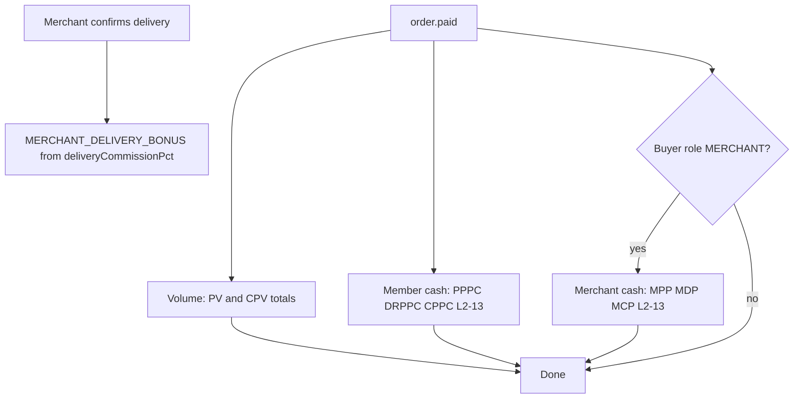

# Frontend Integration — Merchant Product Earnings (Dual Stream)

**Date:** 2026-05-27  
**Backend change:** Merchants earn **twice** on product purchases — once as an **activated member** and again as a **merchant** — with quantity-aware PV/CPV and admin-configured merchant commission rates.

Use this guide for **merchant dashboards**, **earnings/wallet UI**, **admin commission config**, and **order confirmation copy*

**Related:** [frontend-integration-product-volume-distribution.md](./frontend-integration-product-volume-distribution.md) (per-product `pv` / `directReferralPv` / `cpv` on prices and order items).

---

## 1. Business rule (summary)

From the compensation plan:

- Every **activated member** who buys products receives member earnings (PV + cash commissions).
- If the buyer is also a **merchant** (`user.role === MERCHANT`), they receive an **additional merchant stream** on the same order.
- **Quantity matters:** all per-unit values on the order line are multiplied by `quantity` before totals are credited.
- **Merchant commission %** (product purchase + delivery) come from **admin config** per merchant tier (`REGIONAL`, `NATIONAL`, `GLOBAL`), not hardcoded in the client.

Default reference rates (business doc; admin can override via API):

| Merchant tier | Product purchase commission | Delivery commission |
|---------------|----------------------------|---------------------|
| REGIONAL      | 3%                         | 4%                  |
| NATIONAL      | 4.5%                       | 6%                  |
| GLOBAL        | 7.5%                       | 10%                 |

---

## 2. When processing runs

### Member product flow — `order.paid`

Triggered when a **member** order is paid (wallet or gateway). Guest checkout has no `userId` → **no** volume or earnings.

Processing order (simplified):

1. **Volume (PV/CPV)** — from order item snapshots × quantity  
2. **Member cash** — PPPC, DRPPC, CPPC  
3. **Merchant cash (second stream)** — only if buyer `role === MERCHANT`

### Merchant delivery bonus — delivery confirmed

`MERCHANT_DELIVERY_BONUS` is credited when a merchant **confirms delivery** (pickup/offline fulfilment), not on `order.paid`.

Rate: `deliveryCommissionPct` from merchant category config ÷ 100 × `order.baseAmount`.

---

## 3. Quantity and order snapshots

### At order create

For each line item the backend stores **per-unit** values from the active product price:

| Field | Meaning |
|-------|---------|
| `quantity` | Units purchased |
| `unitPrice` | Price per unit (USD base internally) |
| `pv` | Personal PV per unit (buyer) |
| `directReferralPv` | Direct referral PV per unit (sponsor) |
| `cpv` | Community CPV pool per unit (uplines) |

### Totals used on `order.paid`

```
totalPv              = Σ (pv × quantity)
totalDirectReferralPv = Σ (directReferralPv × quantity)
totalCpv             = Σ (cpv × quantity)
baseAmount           = Σ (unitPrice × quantity)   // cash commission base
```

**Frontend:** Show line-level `pv`, `directReferralPv`, `cpv` and multiply by `quantity` in UI previews. Order API already returns per-unit snapshots on each item (see product volume doc).

---

## 4. Dual earning streams (member + merchant)

### Stream A — Member (every paid buyer)

Applies to **all** registration-paid buyers, including merchants.

#### Volume (ledger / CPV history)

| What | Recipient | Source constant |
|------|-----------|-----------------|
| Personal product PV | Buyer | `PRODUCT_PURCHASE_PV` |
| Direct referral product PV | Direct sponsor (`referredById`) | `DIRECT_REFERRAL_PRODUCT_PV` |
| Community product CPV | Matrix uplines (split) | `COMMUNITY_PRODUCT_MATRIX` |

Community CPV uses the same **depth gate** as community registration CPV (sponsor must have a paid sponsor; direct sponsor excluded from CPV split).

#### Cash (wallet earnings)

| Ledger type | Recipient | Rate (current backend) | Level |
|-------------|-----------|------------------------|-------|
| `PERSONAL_PRODUCT_PURCHASE` (PPPC) | Buyer | 5% of `baseAmount` | — |
| `DIRECT_REFERRAL_PRODUCT_PURCHASE` (DRPPC) | Direct sponsor | 3% of `baseAmount` | 1 |
| `COMMUNITY_PRODUCT_PURCHASE` (CPPC) | Matrix uplines | **1% per level** | **2–13 only** |

Level 1 cash is **direct referral only**; community cash starts at matrix level 2.

Existing earnings cards (`GET /earnings/cards/summary`): `PPPC`, `DRPPC`, `CPPC`.

---

### Stream B — Merchant (buyer must be merchant)

Runs **in addition** to Stream A when `user.role === MERCHANT` and a `Merchant` row exists for that user.

#### Cash (wallet earnings)

| Ledger type | Recipient | Rate | Level |
|-------------|-----------|------|-------|
| `MERCHANT_PERSONAL_PRODUCT` | Merchant buyer | `productCommissionPct` ÷ 100 × `baseAmount` | — |
| `MERCHANT_DIRECT_REFERRAL_PRODUCT` | Buyer’s direct sponsor (if registration-paid) | Same `productCommissionPct` | 1 |
| `MERCHANT_COMMUNITY_PRODUCT` | Matrix uplines (registration-paid) | **1% per level** (fixed) | **2–13** |

`productCommissionPct` is read from `MerchantCategoryConfig` for the buyer’s merchant **type** (`REGIONAL` / `NATIONAL` / `GLOBAL`).

**Note:** `MERCHANT_DIRECT_REFERRAL_PRODUCT` is credited to the **sponsor of the merchant buyer**, not “only sponsors who referred a merchant into the company.” That is a separate merchant-recruitment rule; this stream follows the buyer’s `referredById` when a merchant purchases products.

#### Volume

Merchant product purchases do **not** add separate merchant PV/CPV types. The merchant still receives member Stream A volume (`pv`, sponsor `directReferralPv`, community `cpv`) like any member.

#### Delivery (separate trigger)

| Ledger type | When | Rate |
|-------------|------|------|
| `MERCHANT_DELIVERY_BONUS` | Delivery confirmed for an order assigned to the merchant | `deliveryCommissionPct` ÷ 100 × `order.baseAmount` |

---

## 5. Admin — commission configuration

### `GET /admin/merchant-category-config`

Returns one row per merchant type. See [merchant-category-config.md](./merchant-category-config.md) for full shapes.

Fields used by this feature:

| Field | Used for |
|-------|----------|
| `productCommissionPct` | `MERCHANT_PERSONAL_PRODUCT`, `MERCHANT_DIRECT_REFERRAL_PRODUCT` on merchant buyer orders |
| `deliveryCommissionPct` | `MERCHANT_DELIVERY_BONUS` on delivery confirmation |

### `PUT /admin/merchant-category-config/:type`

**:type** = `REGIONAL` | `NATIONAL` | `GLOBAL`

```json
{
  "deliveryCommissionPct": 4,
  "productCommissionPct": 3
}
```

### Public / application flow

- **`GET /settings/merchant-rules`** — same commission + fee info for authenticated users (read-only display).
- **`GET /merchants/category-config`** — merchant application flow (see merchant-category-config doc).

**Admin UI checklist**

- [ ] Commission form per tier: `productCommissionPct`, `deliveryCommissionPct` (match business doc labels).
- [ ] Help text: product % applies on **merchant’s own bulk purchases** (second stream); delivery % applies when merchant **confirms customer pickup/delivery**.

---

## 6. Merchant-facing API — earnings split

### `GET /merchants/earnings/summary`

**Auth:** Merchant (`MerchantGuard`).

Splits the merchant user’s wallet earnings into **merchant stream** vs **network (member) stream**:

```json
{
  "currency": "NGN",
  "merchantEarnings": {
    "totalEarnings": 150000,
    "availableEarnings": 120000,
    "pendingEarnings": 30000,
    "byType": {
      "personalProduct": 50000,
      "directReferralProduct": 20000,
      "communityProduct": 30000,
      "deliveryBonus": 50000
    }
  },
  "networkEarnings": {
    "totalEarnings": 80000,
    "availableEarnings": 80000,
    "pendingEarnings": 0,
    "byType": {
      "PERSONAL_PRODUCT_PURCHASE": 10000,
      "DIRECT_REFERRAL_PRODUCT_PURCHASE": 5000,
      "LEVEL_COMMISSION": 65000
    }
  }
}
```

| `merchantEarnings.byType` key | `LedgerEarningType` |
|------------------------------|---------------------|
| `personalProduct` | `MERCHANT_PERSONAL_PRODUCT` |
| `directReferralProduct` | `MERCHANT_DIRECT_REFERRAL_PRODUCT` |
| `communityProduct` | `MERCHANT_COMMUNITY_PRODUCT` |
| `deliveryBonus` | `MERCHANT_DELIVERY_BONUS` |

`networkEarnings` aggregates all other earning types (PPPC, DRPPC, CPPC, PDPA, level commission, etc.).

Amounts are in the user’s `registrationCurrency` display basis (same as other earnings endpoints).

**Merchant dashboard UI**

- [ ] Show two sections: “Earnings as merchant” vs “Earnings as member”.
- [ ] Bulk purchase confirmation: show member PV total + merchant product commission estimate (use `productCommissionPct` from tier config × cart `baseAmount`).
- [ ] Do not double-count: merchant purchase shows **both** streams in history/activity.

---

## 7. Activity log and earnings list

Merchant types appear in:

- **`GET /earnings`** — `earningType` values `MERCHANT_*`
- **`GET /earnings/activity`** (ledger + PV rows) — merchant cash credits as ledger `EARNING` entries

There are **no** dedicated earnings card keys for `MERCHANT_*` yet; use earnings summary, activity log, or filter `GET /earnings` by type.

Suggested display labels:

| `earningType` | Label |
|---------------|-------|
| `MERCHANT_PERSONAL_PRODUCT` | Merchant product purchase commission |
| `MERCHANT_DIRECT_REFERRAL_PRODUCT` | Merchant direct referral product commission |
| `MERCHANT_COMMUNITY_PRODUCT` | Merchant community product commission |
| `MERCHANT_DELIVERY_BONUS` | Merchant delivery commission |

Metadata on merchant product earnings (when present): `orderId`, `buyerId`, `baseAmount`, `ratePct`, `level`, `merchantType`, `source: "merchant_product_purchase"`.

---

## 8. Flow diagram



---

## 9. Frontend copy guidelines

### Merchant buying stock (bulk)

- “You earn **{member PV}** personal product PV as a member.”
- “You also earn **{productCommissionPct}%** merchant product commission on this order.”
- Do not imply CPV from product `cpv` goes to the buyer.

### Sponsor / upline

- Member stream: existing DRPPC / CPPC / direct referral PV messaging.
- Merchant stream (only when downline merchant buys): additional `MERCHANT_*` credits; community merchant cash is level 2–13 at 1%.

### Guarantees

- Community CPV and some uplines depend on matrix eligibility — use “subject to plan rules” where needed.
- Config changes apply to **new** orders after admin saves; historical orders keep snapshotted values.

---

## 10. Quick QA scenarios

1. **Admin** sets REGIONAL `productCommissionPct: 3`, `deliveryCommissionPct: 4` → `GET /settings/merchant-rules` reflects values.  
2. **Merchant** buys qty 2 (`pv: 3` per unit) → buyer `PRODUCT_PURCHASE_PV` = **6**; member PPPC on full `baseAmount`.  
3. Same order → merchant receives **additional** `MERCHANT_PERSONAL_PRODUCT` = `baseAmount × 3%`.  
4. Merchant’s sponsor (paid) receives DRPPC (member) **and** `MERCHANT_DIRECT_REFERRAL_PRODUCT` (merchant stream) at sponsor’s `productCommissionPct`.  
5. Uplines at levels 2–13 receive CPPC (1% each) and `MERCHANT_COMMUNITY_PRODUCT` (1% each) when eligible.  
6. Merchant confirms delivery on a customer order → `MERCHANT_DELIVERY_BONUS` = `baseAmount × deliveryCommissionPct%`.  
7. **`GET /merchants/earnings/summary`** — `merchantEarnings` and `networkEarnings` totals match sum of respective types.  
8. Non-merchant buyer → no `MERCHANT_*` rows; member stream only.

---

## 11. Related docs

- [frontend-integration-product-volume-distribution.md](./frontend-integration-product-volume-distribution.md) — product price PV fields and order items  
- [merchant-category-config.md](./merchant-category-config.md) — admin CRUD for commission % and onboarding  
- [merchant-flow-frontend.md](./merchant-flow-frontend.md) — application, fulfilment, inventory  
- [features/13-orders-purchases.md](../features/13-orders-purchases.md) — order lifecycle  
- [API.md](../API.md) — auth, guards, enums  
