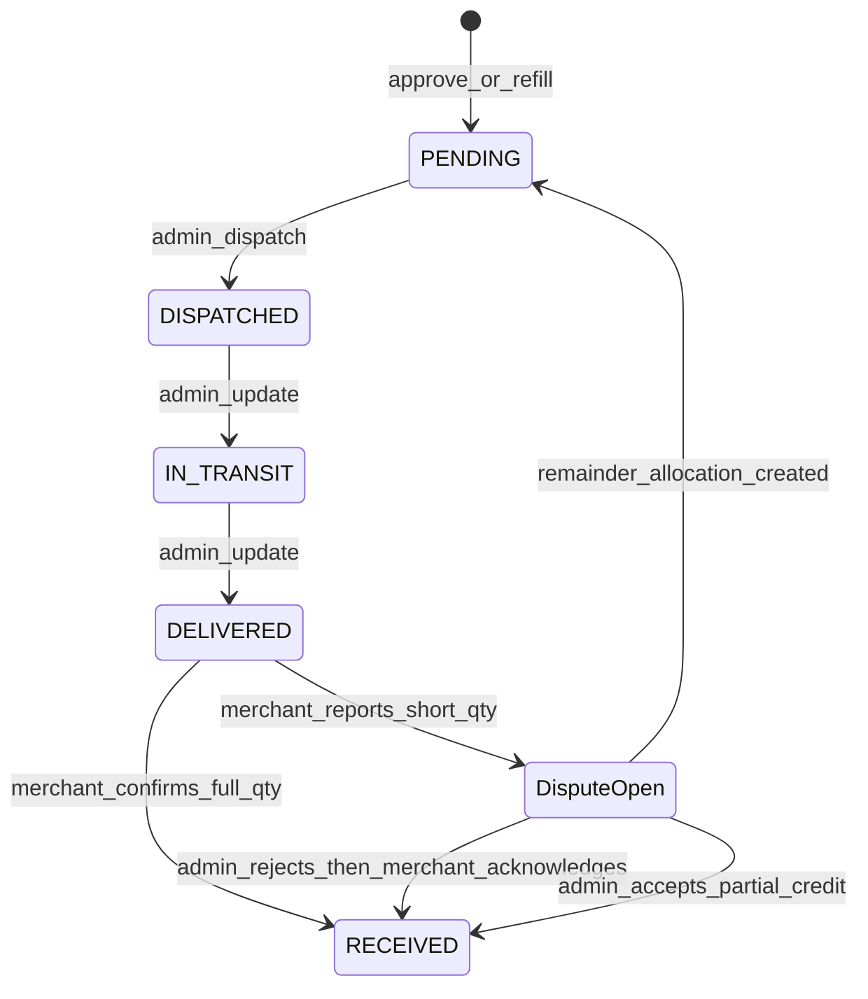

# Frontend Integration — Merchant Stock Dispatch & Receipt Disputes

**Requirement 3 of 5**  
**Date:** 2026-07-02  
**Status:** **Shipped**  
**Audience:** Admin app + merchant app

Related:

- [merchant-flow-frontend.md](./merchant-flow-frontend.md) — merchant onboarding overview (updated)
- [frontend-integration-admin-product-stock.md](./frontend-integration-admin-product-stock.md) — warehouse pool

---

## 1. Overview

After merchant **approval** or **refill**, stock is **not** credited immediately. Flow:

1. Admin creates allocation (`PENDING`) — already happens on approve/refill
2. Admin **dispatches** from warehouse → merchant notified
3. Admin marks **in transit** → **delivered**
4. Merchant **confirms receipt** with quantity received
5. If qty &lt; dispatched → **dispute** auto-opens (evidence required)
6. Admin **rejects** or **accepts** dispute offline
7. Merchant **acknowledges** rejected dispute OR admin **dispatches remainder** after accepted dispute



---

## 2. Admin endpoints

Base: `/admin/merchants` — Bearer + admin role + RBAC.

| Method | Path | Permission | Description |
|--------|------|------------|-------------|
| `GET` | `/:merchantId/allocations` | `merchants.view_details` | List allocations + status |
| `POST` | `/:merchantId/allocations/:allocationId/dispatch` | `merchants.dispatch_stock` | Dispatch full allocation qty; decrements warehouse pool |
| `PATCH` | `/:merchantId/allocations/:allocationId/status` | `merchants.dispatch_stock` | Body: `{ "status": "IN_TRANSIT" \| "DELIVERED" }` |
| `GET` | `/stock-disputes` | `merchants.view` | List disputes (filter `status`, `merchantId`) |
| `POST` | `/stock-disputes/:disputeId/reject` | `merchants.resolve_stock_dispute` | Reject dispute; merchant must acknowledge |
| `POST` | `/stock-disputes/:disputeId/accept` | `merchants.resolve_stock_dispute` | Accept dispute; credit claimed qty + create remainder allocation if needed |

### Dispatch request

```json
{
  "dispatchNotes": "Courier: DHL",
  "trackingReference": "TRK-12345"
}
```

### Allocation row (admin + merchant lists)

```json
{
  "id": "uuid",
  "productId": "uuid",
  "productName": "Red Wine",
  "quantity": 10,
  "status": "DELIVERED",
  "quantityReceived": null,
  "dispatchedAt": "2026-07-02T10:00:00.000Z",
  "inTransitAt": "2026-07-02T12:00:00.000Z",
  "deliveredAt": "2026-07-02T18:00:00.000Z",
  "receivedAt": null,
  "trackingReference": "TRK-12345",
  "parentAllocationId": null,
  "dispute": {
    "id": "uuid",
    "status": "OPEN",
    "dispatchedQuantity": 10,
    "claimedReceivedQuantity": 7
  }
}
```

### Status values

`PENDING` | `DISPATCHED` | `IN_TRANSIT` | `DELIVERED` | `RECEIVED` | `ACCEPTED` (legacy) | `CANCELLED`

---

## 3. Merchant endpoints

| Method | Path | Description |
|--------|------|-------------|
| `GET` | `/merchants/me/allocations` | Allocations with dispatch status + dispute summary |
| `POST` | `/merchants/me/allocations/:id/confirm-receipt` | Confirm qty received (`multipart/form-data`) |
| `GET` | `/merchants/me/stock-disputes` | My disputes |
| `POST` | `/merchants/me/stock-disputes/:id/acknowledge` | After admin **rejected** dispute |
| `POST` | `/merchants/me/allocations/:id/accept` | **Deprecated** — returns `410 Gone` |

### Confirm receipt (`multipart/form-data`)

| Field | Required | Notes |
|-------|----------|-------|
| `quantityReceived` | Yes | Integer ≥ 0 |
| `merchantNotes` | No | Required context for disputes |
| `evidence` | If qty &lt; dispatched | One or more images/PDF (max 10 files) |

**Rules:**

- Only when allocation `status === DELIVERED`
- `quantityReceived === quantity` → stock credited, `RECEIVED`
- `quantityReceived < quantity` → dispute `OPEN`, evidence required
- `quantityReceived > quantity` → `400`

---

## 4. Dispute resolution flows

### Example: 10 wines dispatched, merchant receives 7

1. Admin dispatches 10 → `DISPATCHED`
2. Admin: `IN_TRANSIT` → `DELIVERED`
3. Merchant confirms `quantityReceived: 7` + uploads evidence → dispute `OPEN`
4. **Admin rejects** → dispute `ADMIN_REJECTED` → merchant notified
5. Merchant `POST .../acknowledge` → 10 units credited, allocation `RECEIVED`

**OR**

4. **Admin accepts** → 7 credited now, new allocation for 3 (`PENDING`, `parentAllocationId` set)
5. Admin dispatches remainder → same flow

### Dispute statuses

`OPEN` | `ADMIN_REJECTED` | `ADMIN_ACCEPTED` | `MERCHANT_ACKNOWLEDGED` | `CLOSED`

---

## 5. Notifications

| Type | Recipient | When |
|------|-----------|------|
| `MERCHANT_ALLOCATION_PENDING` | Merchant | Approve/refill creates allocation |
| `MERCHANT_STOCK_DISPATCHED` | Merchant | Admin dispatches |
| `MERCHANT_STOCK_IN_TRANSIT` | Merchant | Admin marks in transit |
| `MERCHANT_STOCK_DELIVERED` | Merchant | Admin marks delivered |
| `MERCHANT_STOCK_DISPUTE_OPENED` | Merchant | Short receipt reported |
| `ADMIN_STOCK_DISPUTE_OPENED` | All admin users | Dispute opened |
| `MERCHANT_STOCK_DISPUTE_REJECTED` | Merchant | Admin rejects |
| `MERCHANT_STOCK_DISPUTE_ACCEPTED` | Merchant | Admin accepts |

Use `metadata.allocationId`, `metadata.disputeId`, `metadata.quantity` for deep links.

---

## 6. UI checklist

### Admin

- [ ] Merchant detail: allocations table with status badges
- [ ] Dispatch button (only `PENDING`)
- [ ] In transit / Delivered actions (linear progression)
- [ ] Stock disputes inbox with evidence viewer
- [ ] Reject / Accept with admin notes

### Merchant

- [ ] Replace “Accept allocation” with “Confirm receipt” (enabled only on `DELIVERED`)
- [ ] Quantity input per product
- [ ] Evidence upload when qty &lt; dispatched
- [ ] Acknowledge rejected dispute CTA
- [ ] Show remainder allocations after accepted dispute

---

## 7. Breaking changes

| Before | After |
|--------|-------|
| `POST /merchants/me/allocations/:id/accept` credits stock immediately | Deprecated (`410`); use confirm-receipt after `DELIVERED` |
| Pool decremented on merchant accept | Pool decremented on **admin dispatch** |
| One allocation per product per merchant (unique) | Multiple allocations allowed (refills + dispute remainders) |

---

## 8. Changelog

| Date | Change |
|------|--------|
| 2026-07-02 | Merchant stock dispatch, receipt confirmation, and dispute resolution (requirement 3) |
