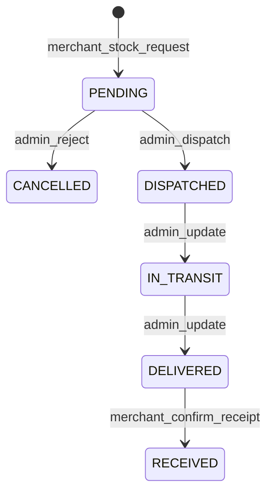

# Frontend Integration — Merchant Stock Top-up Requests

**Feature:** Merchant-initiated warehouse top-up (1A / 2A)  
**Status:** Shipped  
**Audience:** Merchant app + admin app  

Related:

- [merchant-flow-frontend.md](./merchant-flow-frontend.md) — onboarding / allocations overview  
- [frontend-integration-merchant-stock-dispatch.md](./frontend-integration-merchant-stock-dispatch.md) — warehouse dispatch & receipt  
- [frontend-integration-merchant-stock-handover.md](./frontend-integration-merchant-stock-handover.md) — merchant-to-merchant handover  

---

## 1. Summary

Any **ACTIVE** merchant may request additional units of an **already assigned** product from the admin warehouse. The request creates a normal `PENDING` allocation with `source: MERCHANT_REQUEST`. Admin is notified, then dispatches via the existing warehouse flow.

**Decisions:**

| Code | Behaviour |
|------|-----------|
| **1A** | Any ACTIVE merchant can request `{ productId, quantity }` anytime (not tied to a handover). |
| **2A** | Handover eligibility is unchanged — supplier must already hold the **full** qty. Short suppliers top up first via this feature, then fulfill handover. |

**Example:** Supplier has 10 of Product A; another merchant needs 15 via handover. Supplier cannot appear as eligible until they have 15. They request **5** via stock request → admin dispatches 5 → after receipt inventory is 15 → they can then approve handover.



---

## 2. Merchant endpoints

Auth: Bearer + `MerchantGuard`.

| Method | Path | Description |
|--------|------|-------------|
| `POST` | `/merchants/me/stock-requests` | Body `{ productId, quantity, notes? }` — creates PENDING allocation |
| `GET` | `/merchants/me/stock-requests` | List own `MERCHANT_REQUEST` allocations; optional `status`, `limit`, `offset` |
| Existing | `POST /merchants/me/allocations/:id/confirm-receipt` | After admin marks `DELIVERED` |

### Request body

```json
{
  "productId": "uuid",
  "quantity": 5,
  "notes": "Need 5 more to fulfill inbound handover"
}
```

Rules:

- Merchant must be **ACTIVE**
- Product must be **assigned** and active on the merchant
- `quantity` integer 1–10000
- **409** if another **PENDING** `MERCHANT_REQUEST` already exists for the same product
- **404** if product not in inventory

### Create response

```json
{
  "message": "Stock request submitted",
  "allocation": {
    "id": "uuid",
    "merchantId": "uuid",
    "productId": "uuid",
    "productName": "Wine",
    "quantity": 5,
    "status": "PENDING",
    "source": "MERCHANT_REQUEST",
    "requestNotes": "Need 5 more to fulfill inbound handover",
    "requestedByUserId": "uuid",
    "cancelledAt": null,
    "cancelReason": null,
    "cancelledByAdminId": null,
    "createdAt": "2026-07-18T10:00:00.000Z"
  }
}
```

### List response

```json
{
  "total": 1,
  "requests": [ /* same allocation shape */ ]
}
```

---

## 3. Admin endpoints

Base: `/admin/merchants` — Bearer + admin + RBAC.

| Method | Path | Permission | Description |
|--------|------|------------|-------------|
| `GET` | `/stock-requests` | `merchants.view` | Queue of merchant top-up requests. Query: `status` (default **PENDING**), `merchantId`, `productId`, `limit`, `offset` |
| `POST` | `/stock-requests/:allocationId/reject` | `merchants.dispatch_stock` | Cancel PENDING `MERCHANT_REQUEST` only. Body `{ "reason"?: string }` |
| Existing | `POST /:merchantId/allocations/:allocationId/dispatch` | `merchants.dispatch_stock` | Same dispatch as onboarding/refill |
| Existing | `PATCH /:merchantId/allocations/:allocationId/status` | `merchants.dispatch_stock` | `IN_TRANSIT` / `DELIVERED` |

### Reject response

```json
{
  "message": "Stock request rejected",
  "allocation": {
    "id": "uuid",
    "status": "CANCELLED",
    "source": "MERCHANT_REQUEST",
    "cancelledAt": "2026-07-18T12:00:00.000Z",
    "cancelReason": "Warehouse short",
    "cancelledByAdminId": "admin-uuid"
  }
}
```

After reject, merchant receives notification `MERCHANT_STOCK_REQUEST_REJECTED`.

---

## 4. Allocation `source` field

All allocation list/detail payloads (including `GET /merchants/me/allocations` and admin merchant allocations) now include:

| Field | Type | Notes |
|-------|------|-------|
| `source` | `CATEGORY` \| `MERCHANT_REQUEST` \| `DISPUTE_REMAINDER` | How the allocation was created |
| `requestNotes` | string \| null | Merchant note (top-up only) |
| `requestedByUserId` | string \| null | Submitter |
| `cancelledAt` / `cancelReason` / `cancelledByAdminId` | | Set when admin rejects a top-up |

| Source | Created by |
|--------|------------|
| `CATEGORY` | Approve / refill (category onboarding items) |
| `MERCHANT_REQUEST` | Merchant stock top-up |
| `DISPUTE_REMAINDER` | Remainder after accepted stock dispute |

---

## 5. Notifications

| Type | Audience | When |
|------|----------|------|
| `ADMIN_MERCHANT_STOCK_REQUESTED` | All admin users | Merchant submits top-up |
| `MERCHANT_STOCK_REQUEST_REJECTED` | Requesting merchant | Admin rejects |
| Existing dispatch / in-transit / delivered | Merchant | Unchanged after admin dispatches |

---

## 6. UI checklist

### Merchant app

- [ ] Inventory / stock screen: **Request stock** CTA per assigned product  
- [ ] Form: quantity + optional notes; disable CTA when a PENDING request already exists for that product  
- [ ] List stock requests with status badges (`PENDING` → dispatch lifecycle or `CANCELLED`)  
- [ ] After `DELIVERED`, reuse existing confirm-receipt flow  
- [ ] Handover UX: if eligible suppliers empty due to short stock, hint “Request stock from admin first” (link to top-up) — do **not** change handover eligibility rules  

### Admin app

- [ ] Stock-request queue (`GET /admin/merchants/stock-requests`) — default PENDING  
- [ ] Row actions: **Dispatch** (deep-link to existing allocation dispatch for that merchant) or **Reject** with optional reason  
- [ ] In-app notification for `ADMIN_MERCHANT_STOCK_REQUESTED`  

---

## 7. Error reference

| Situation | Status | Message hint |
|-----------|--------|--------------|
| Inactive merchant | 400 | must be ACTIVE |
| Product not assigned | 404 | not found in your inventory |
| Duplicate PENDING request | 409 | pending stock request already exists |
| Reject non-PENDING / non-MERCHANT_REQUEST | 400 | must be PENDING / only merchant-requested |
| Insufficient warehouse on dispatch | 400 | existing pool insufficient error |
