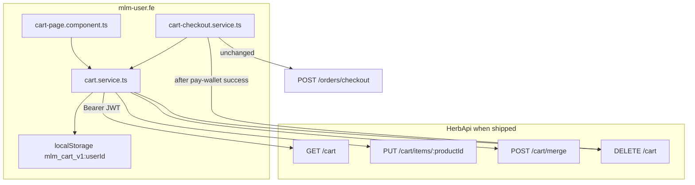
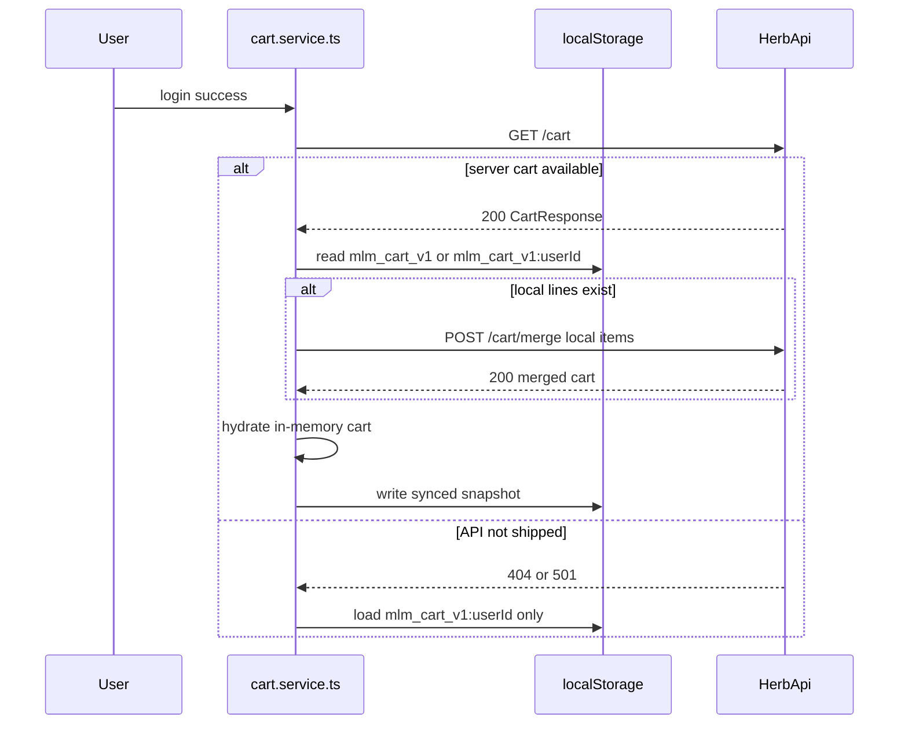
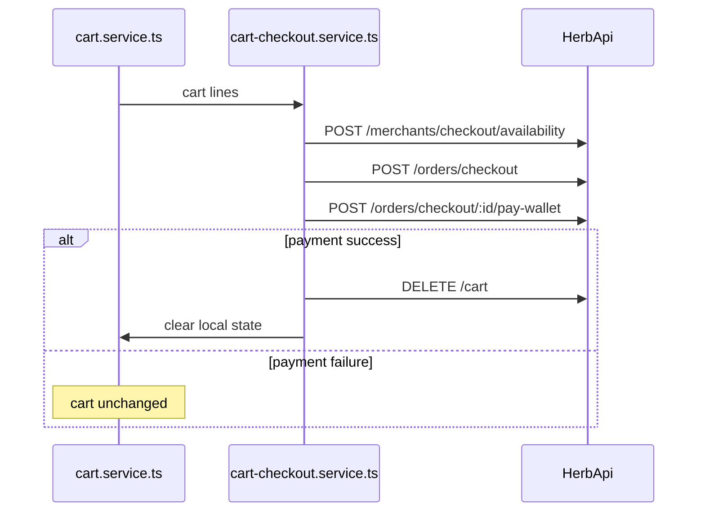

# Frontend Integration — Server-Side Cart (Cross-Device Sync)

**Date:** 2026-07-13  
**Status:** **Shipped** — backend `/cart` endpoints live; FE sync auto-enables on `GET /cart` 200  
**Audience:** `mlm-user.fe` (Angular customer app)

Related:

- [BACKEND_REQUEST_SERVER_SIDE_CART.md](./BACKEND_REQUEST_SERVER_SIDE_CART.md) — backend API contract and acceptance criteria
- [frontend-integration-customer-checkout-pickup.md](./frontend-integration-customer-checkout-pickup.md) — checkout flow (unchanged; cart cleared after payment)
- [frontend-integration-scheduled-product-pricing.md](./frontend-integration-scheduled-product-pricing.md) — `purchasable`, `priceStatus`, `availableFrom` on product snapshots
- [shop-guest-checkout.md](./shop-guest-checkout.md) — guest checkout (separate; does not use `/cart`)

---

## 1. Summary

### Problem

The cart is stored only in browser `localStorage` (`mlm_cart_v1`). Each device keeps its own copy, so the same user sees **different cart contents on different devices** after login.

**Example (user `DELE1`):**

| Device | Cart state |
|--------|------------|
| Laptop | 14 products |
| Phone A | 3 products |
| Phone B | Empty |

Refreshing did not reconcile counts because there is no server cart.

### Goal

**One cart per authenticated user**, persisted on the server, synced across devices. The frontend uses a **dual-mode** `cart.service.ts`:

- **Server mode** — when `GET /cart` returns `200`, all mutations sync via API.
- **Local-only mode** — when the API is absent (`404` / `501`), fall back to per-user `localStorage`.

### Scope

| In scope | Out of scope |
|----------|--------------|
| Member cart for logged-in users | Guest checkout cart ([shop-guest-checkout.md](./shop-guest-checkout.md)) |
| Cross-device sync via `/cart` | Stock reservation in cart |
| Merge on login | Admin cart management |
| Clear cart after successful checkout | Changes to `POST /orders/checkout` payload |



---

## 2. Architecture — dual-mode cart service

`cart.service.ts` is the single source of truth for cart state. Components (`cart-page`, product cards, header badge) subscribe to its observable; they do not call `/cart` directly.

### 2.1 Mode detection

Run on **login success** and **app init** when the user is already authenticated:

1. Call `GET /cart` with `Authorization: Bearer <accessToken>`.
2. **`200`** → enable **server mode**; hydrate in-memory cart from response; server is authority.
3. **`404` or `501`** → stay in **local-only mode**; load `mlm_cart_v1:{userId}` from `localStorage`.
4. **`401`** → user not authenticated; do not call cart APIs.

Server mode is enabled automatically when the backend ships — no feature flag or separate FE deploy is required beyond the existing `mlm-user.fe` implementation.

### 2.2 Storage keys

| Key | Purpose |
|-----|---------|
| `mlm_cart_v1` | Legacy device-wide key; migrate to per-user key on login |
| `mlm_cart_v1:{userId}` | Per-user local fallback, offline buffer, and post-sync cache |

On login, if legacy `mlm_cart_v1` exists, migrate its lines into `mlm_cart_v1:{userId}` before merge.

### 2.3 Absolute quantity (not delta)

`PUT /cart/items/{productId}` sets the **absolute** line quantity. This is a common integration mistake.

| User action | Request body | Result |
|-------------|--------------|--------|
| Add product (new line) | `{ "quantity": 1 }` | Line created with qty 1 |
| Change qty to 5 | `{ "quantity": 5 }` | Line qty is **5**, not previous + 5 |
| Remove line | `{ "quantity": 0 }` | Line deleted |

---

## 3. API reference

All cart routes require `Authorization: Bearer <accessToken>`. Cart uses **JWT only** — unlike checkout, it does **not** require registration paid (`RegistrationPaidGuard`). Unpaid members may browse and build a cart; checkout still enforces registration.

| Method | Path | When FE calls |
|--------|------|---------------|
| `GET` | `/cart` | App init after login; after merge; optional refresh on cart page |
| `PUT` | `/cart/items/:productId` | Add, update quantity, remove (`quantity: 0`) |
| `POST` | `/cart/merge` | Once per login session when local lines exist |
| `DELETE` | `/cart` | User clears cart; after successful `pay-wallet` |

### 3.1 `GET /cart`

Returns the authenticated user's cart.

**Response `200`:**

```json
{
  "items": [
    {
      "productId": "uuid-product-1",
      "quantity": 2,
      "product": {
        "id": "uuid-product-1",
        "name": "Herbal Tea",
        "description": "...",
        "memberPriceNGN": 5000,
        "nonMemberPriceNGN": 6000,
        "price": 5000,
        "currency": "NGN",
        "pv": 10,
        "directReferralPv": 5,
        "cpv": 2,
        "category": "health",
        "images": ["/products/tea.png"],
        "inStock": true,
        "eligibleWallets": ["cash", "voucher"],
        "purchasable": true,
        "availableFrom": null,
        "nextPriceEffectiveFrom": null,
        "priceStatus": "active"
      }
    }
  ]
}
```

- Empty cart: `{ "items": [] }`
- Unknown `productId` in DB: backend may omit the line or return with `purchasable: false` — FE handles either

### 3.2 `PUT /cart/items/:productId`

Upsert a single line. Body: `{ "quantity": <number> }`.

| `quantity` | Behavior |
|------------|----------|
| `> 0` | Set line quantity (create or update) |
| `0` | Remove line |

**Response `200`:** full cart (same shape as `GET /cart`).

### 3.3 `POST /cart/merge`

Merge device-local lines into the server cart after login. Call **once per session** when local lines exist.

**Request:**

```json
{
  "items": [
    { "productId": "uuid-product-1", "quantity": 14 },
    { "productId": "uuid-product-2", "quantity": 3 }
  ]
}
```

**Merge rule:** for each `productId`, server quantity = `max(serverQuantity, incomingQuantity)`.

**Example:** Laptop has 14 × product X on server; phone has 3 × product X locally → after merge, server has **14**.

**Response `200`:** full merged cart.

### 3.4 `DELETE /cart`

Clear all lines for the authenticated user.

**Response:** `204 No Content` or `{ "items": [] }`.

Called when the user taps "Clear cart" and after successful wallet payment in `cart-checkout.service.ts`.

---

## 4. TypeScript types

Use these interfaces in `cart.service.ts` and cart components:

```typescript
interface CartProductSnapshot {
  id: string;
  name: string;
  description?: string;
  memberPriceNGN: number;
  nonMemberPriceNGN: number;
  price: number;           // member display price for cart line totals
  currency: string;
  pv: number;
  directReferralPv?: number;
  cpv?: number;
  category?: string;
  images: string[];        // URL strings for cart thumbnails
  inStock: boolean;
  eligibleWallets?: string[];
  purchasable: boolean;
  availableFrom?: string | null;
  nextPriceEffectiveFrom?: string | null;
  priceStatus: 'active' | 'scheduled' | 'unpriced';
}

interface CartLine {
  productId: string;
  quantity: number;
  product: CartProductSnapshot;
}

interface CartResponse {
  items: CartLine[];
}
```

### 4.1 Backend alignment — snapshot mapper

The backend may return product snapshots in one of two shapes until OpenAPI is finalized:

| Shape | Source | Notes |
|-------|--------|-------|
| **Flattened** | [BACKEND_REQUEST_SERVER_SIDE_CART.md](./BACKEND_REQUEST_SERVER_SIDE_CART.md) §4 | `price`, `pv`, `images` as string URLs at top level |
| **Catalog-nested** | Product catalog API shape | `currentPrice` object, `images` as `{ id, url, altText, position }[]` |

Implement a single **`normalizeCartSnapshot()`** mapper in `cart.service.ts` that accepts either shape and returns `CartProductSnapshot`. Rules:

1. **Prefer server snapshot** for cart UI (price, `purchasable`, `inStock`) over stale catalog cache from when the item was added.
2. **Images:** if `images` is an object array, map to `images[].url`; if already strings, use as-is.
3. **Price:** if `currentPrice` exists, set `price` from `memberDisplayPrice` (or `memberPriceNGN` as fallback) and `currency` from `displayCurrency`.
4. **PV:** read from flattened `pv` or `currentPrice.pv`.
5. **Purchasability:** copy `purchasable`, `availableFrom`, `nextPriceEffectiveFrom`, `priceStatus` from catalog fields when present.

Example mapper skeleton:

```typescript
function normalizeCartSnapshot(raw: unknown): CartProductSnapshot {
  const p = raw as Record<string, unknown>;
  const currentPrice = p['currentPrice'] as Record<string, unknown> | null | undefined;

  const imagesRaw = p['images'] as unknown;
  const images: string[] = Array.isArray(imagesRaw)
    ? imagesRaw.map((img) =>
        typeof img === 'string' ? img : (img as { url: string }).url,
      )
    : [];

  return {
    id: String(p['id'] ?? p['productId']),
    name: String(p['name'] ?? ''),
    description: p['description'] as string | undefined,
    memberPriceNGN: Number(p['memberPriceNGN'] ?? currentPrice?.['memberPriceNGN'] ?? 0),
    nonMemberPriceNGN: Number(p['nonMemberPriceNGN'] ?? currentPrice?.['nonMemberPriceNGN'] ?? 0),
    price: Number(
      p['price'] ?? currentPrice?.['memberDisplayPrice'] ?? currentPrice?.['memberPriceNGN'] ?? 0,
    ),
    currency: String(p['currency'] ?? currentPrice?.['displayCurrency'] ?? 'NGN'),
    pv: Number(p['pv'] ?? currentPrice?.['pv'] ?? 0),
    directReferralPv: (p['directReferralPv'] ?? currentPrice?.['directReferralPv']) as number | undefined,
    cpv: (p['cpv'] ?? currentPrice?.['cpv']) as number | undefined,
    category: p['category'] as string | undefined,
    images,
    inStock: Boolean(p['inStock'] ?? true),
    eligibleWallets: p['eligibleWallets'] as string[] | undefined,
    purchasable: Boolean(p['purchasable'] ?? true),
    availableFrom: (p['availableFrom'] as string | null) ?? null,
    nextPriceEffectiveFrom: (p['nextPriceEffectiveFrom'] as string | null) ?? null,
    priceStatus: (p['priceStatus'] as CartProductSnapshot['priceStatus']) ?? 'active',
  };
}

function normalizeCartResponse(raw: { items: Array<{ productId: string; quantity: number; product: unknown }> }): CartResponse {
  return {
    items: raw.items.map((line) => ({
      productId: line.productId,
      quantity: line.quantity,
      product: normalizeCartSnapshot(line.product),
    })),
  };
}
```

Reconcile the mapper against the live OpenAPI spec once the cart module ships (`npm run openapi:dump` → `docs/openapi.json`).

---

## 5. Lifecycle flows

### 5.1 Login + merge



Steps:

1. Migrate legacy `mlm_cart_v1` → `mlm_cart_v1:{userId}` if needed.
2. Probe `GET /cart`.
3. If server mode and local lines exist → `POST /cart/merge` with local `{ productId, quantity }[]` (no product snapshot in merge body).
4. Replace in-memory state with normalized server response; persist to `localStorage`.

### 5.2 Add / update / remove (optimistic)

1. Update in-memory state and `localStorage` immediately.
2. If server mode: `PUT /cart/items/{productId}` with **absolute** quantity.
3. On success: replace state with full cart from response (server snapshot is fresh).
4. On failure: revert optimistic update; show error toast.

### 5.3 Logout

- Clear **in-memory** cart state (header badge shows 0).
- Do **not** call `DELETE /cart` — server cart persists.
- On next login, `GET /cart` restores server lines.

### 5.4 Checkout

Checkout APIs are **unchanged**. See [frontend-integration-customer-checkout-pickup.md](./frontend-integration-customer-checkout-pickup.md).

1. Build checkout payload from cart lines: `{ productId, quantity }` only.
2. `POST /merchants/checkout/availability` → validate against state.
3. `POST /orders/checkout` → create split orders.
4. `POST /orders/checkout/:checkoutId/pay-wallet` → pay batch.
5. On **successful** payment: `DELETE /cart` (server mode) + clear `mlm_cart_v1:{userId}`.
6. On payment failure: cart unchanged.



---

## 6. UI rules

Cart page and product cards should follow [frontend-integration-scheduled-product-pricing.md](./frontend-integration-scheduled-product-pricing.md).

### 6.1 Cart page (`cart-page.component.ts`)

| Field | UI behavior |
|-------|-------------|
| `purchasable: false` | Show line as unavailable; disable quantity increase; allow remove |
| `inStock: false` | Show out-of-stock badge; do not block navigation to checkout (server validates at order create) |
| `priceStatus: scheduled` | Show "Available from …" using `availableFrom` |
| `price` / `currency` | Line subtotal = `price * quantity`; sum for cart total |
| `pv` / `cpv` | Show volume summary if the cart page displays PV |

### 6.2 Product pages (add to cart)

- **Block** add-to-cart when catalog `purchasable === false` (marketplace list/detail).
- Server may still return lines for unavailable products (e.g. price lapsed after add) — cart page handles display using snapshot flags.

### 6.3 Clear cart

"Clear cart" button → confirm dialog → `DELETE /cart` (server mode) + clear `localStorage` + empty in-memory state.

---

## 7. Error handling

| Status | FE action |
|--------|-----------|
| `401` | Redirect to login; do not call cart APIs |
| `404` / `501` on `GET /cart` | Disable server mode for session; local-only; no user-facing error |
| `404` on `PUT` (unknown product) | Remove line locally or show unavailable per backend behavior |
| Network error on `PUT` | Revert optimistic update; optional retry |
| `403` on checkout | Registration gate — separate from cart; show activation prompt |

---

## 8. Files in `mlm-user.fe`

| File | Responsibility |
|------|----------------|
| `src/app/services/cart.service.ts` | Mode detection, API calls, `localStorage`, merge, optimistic updates, `normalizeCartSnapshot()` |
| `src/app/pages/shop/cart-page/cart-page.component.ts` | Cart UI, quantity controls, unavailable states |
| `src/app/services/cart-checkout.service.ts` | Checkout orchestration; `DELETE /cart` after successful payment |
| `src/app/services/order.service.ts` | Checkout APIs (unchanged) |

### 8.1 Implementation verification checklist

| Item | Expected behavior |
|------|-------------------|
| Per-user `localStorage` key (`mlm_cart_v1:{userId}`) | Different users on same browser do not share cart |
| Legacy `mlm_cart_v1` migration on login | Old device cart moves to user-scoped key |
| `GET /cart` feature detection | `404`/`501` → local-only; `200` → server mode |
| `POST /cart/merge` on login | Runs once when local lines exist; max qty wins |
| Optimistic `PUT` | Add/update/remove sync to server; revert on failure |
| `DELETE /cart` on clear / post-checkout | Server and local cart empty |
| Reset in-memory cart on logout | Badge clears; server cart preserved |

---

## 9. Acceptance criteria

- [ ] Same user (`DELE1`) sees identical cart on laptop and two phones after login.
- [ ] Quantity input sets absolute value (type `5` → quantity is 5, not +5).
- [ ] Remove line via remove button or `PUT` with `quantity: 0`.
- [ ] Login with local items triggers merge once; max quantity per `productId` wins.
- [ ] Post-checkout cart empty on all devices after refresh.
- [ ] Logout then login does not lose server cart.
- [ ] `GET /cart` returning `404` — app works with local cart only; no error toast.
- [ ] Cart snapshot drives UI: `price`, `pv`, `inStock`, `purchasable`, `images` render without extra catalog fetch.

---

## 10. Manual test plan

1. **Cross-device sync:** Device A — add 3 products. Device B — login as same user → same 3 lines.
2. **Merge max qty:** Device A — 14 × product X on server. Device B — 3 × product X locally → login → merge → quantity is 14 everywhere.
3. **Remove line:** Set quantity to 0 or tap remove → line gone; other devices see empty line on next `GET /cart`.
4. **Clear cart:** Tap clear → `DELETE /cart` → UI empty; `GET /cart` returns `{ "items": [] }`.
5. **Checkout:** Full flow through `pay-wallet` → cart empty; refresh on second device shows empty cart.
6. **Backend absent:** With `/cart` not deployed (`404`) → add/update/remove still works via `localStorage`; no regression.
7. **Logout/login:** Add items → logout → login → server cart restored (not wiped).
8. **Unavailable product:** Line with `purchasable: false` shows unavailable state; user can remove but not increase qty.

---

## 11. Out of scope

- Stock reservation in cart (checkout validates stock)
- Guest / member cart unification
- Admin cart management
- Changes to `POST /orders/checkout` request or response shape
