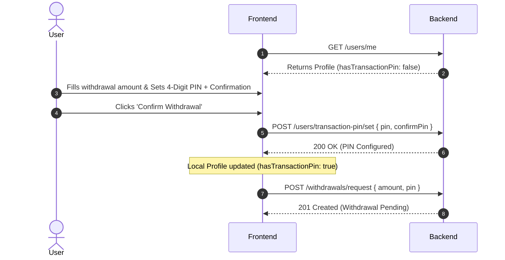

# Transaction PIN API Specification

This document details the backend REST API endpoints required to implement, manage, and verify transaction PINs for secure wallet operations (such as withdrawals).

---

## User Profile Status (GET `/users/me`)

The user profile response must include a flag indicating whether the user has successfully configured their transaction PIN.

### Updated Profile Response (`GET /users/me`)
```json
{
  "id": "user_123",
  "email": "user@example.com",
  "firstName": "John",
  "lastName": "Doe",
  "paymentStatus": "PAID",
  "hasTransactionPin": false 
}
```

- `hasTransactionPin` (boolean, required): `true` if the user has already configured their transaction PIN, otherwise `false`.

---

## 1. POST `/users/transaction-pin/set`

### Overview
Allows a user to set their initial 4-digit transaction PIN. During withdrawal, if `hasTransactionPin` is `false`, the frontend will prompt the user to set and confirm their PIN, and invoke this endpoint automatically before executing the withdrawal.

### HTTP Method
**POST**

### URL Path
`/users/transaction-pin/set`

### Authentication
**Required** – Bearer JWT.

### Request Body
**Schema (`SetTransactionPinDto`)**
```json
{
  "pin": "1234",
  "confirmPin": "1234"
}
```

- `pin` (string, required): Must be exactly a 4-digit numeric string (e.g. `^\d{4}$`).
- `confirmPin` (string, required): Must match `pin`.

### Response
**Success 200 OK**
```json
{
  "success": true,
  "message": "Transaction PIN has been successfully configured."
}
```

---

## 2. PUT `/users/transaction-pin/change`

### Overview
Allows a user to change their existing transaction PIN by providing their old PIN.

### HTTP Method
**PUT**

### URL Path
`/users/transaction-pin/change`

### Request Body
**Schema (`ChangeTransactionPinDto`)**
```json
{
  "oldPin": "1234",
  "newPin": "5678",
  "confirmNewPin": "5678"
}
```

- `oldPin` (string, required): Must match the user's current transaction PIN.
- `newPin` (string, required): Must be exactly a 4-digit numeric string.
- `confirmNewPin` (string, required): Must match `newPin`.

### Response
**Success 200 OK**
```json
{
  "success": true,
  "message": "Transaction PIN has been changed successfully."
}
```

---

## 3. POST `/users/transaction-pin/reset-request` & `/users/transaction-pin/reset`

### Overview
If a user forgets their transaction PIN, they can request a reset. This initiates a secure OTP-based flow.

### Step 3a: POST `/users/transaction-pin/reset-request`
Triggers an OTP sent to the user's registered email.

**HTTP Method**: POST  
**URL Path**: `/users/transaction-pin/reset-request`  
**Request Body**: None (inferred from JWT user details).

**Response 200 OK**:
```json
{
  "success": true,
  "message": "A reset OTP has been sent to your registered email."
}
```

### Step 3b: POST `/users/transaction-pin/reset`
Performs the reset using the received OTP.

**HTTP Method**: POST  
**URL Path**: `/users/transaction-pin/reset`  
**Request Body**:
```json
{
  "otp": "654321",
  "newPin": "9999",
  "confirmNewPin": "9999"
}
```

**Response 200 OK**:
```json
{
  "success": true,
  "message": "Your transaction PIN has been reset successfully."
}
```

---

## 4. POST `/users/transaction-pin/verify`

### Overview
One-off verification of a transaction PIN. Can be used for multi-step modals before performing sensitive tasks.

### HTTP Method
**POST**

### URL Path
`/users/transaction-pin/verify`

### Request Body
```json
{
  "pin": "1234"
}
```

### Response
**Success 200 OK** (PIN is valid):
```json
{
  "valid": true
}
```

**Error 400 Bad Request** (Incorrect PIN):
```json
{
  "statusCode": 400,
  "message": "Incorrect transaction PIN.",
  "error": "Bad Request"
}
```

---

## 5. Sequential Withdrawal Flow with Dynamic PIN Setup

When a user submits a withdrawal:



### POST `/withdrawals/request` Integration
The withdrawal request endpoint must accept and validate the transaction PIN in the request body.

### Request Body (`CreateWithdrawalDto`)
```json
{
  "amount": 100.0,
  "pin": "1234"
}
```

### Backend Validation Rules for `/withdrawals/request`
1. Verify Bearer JWT.
2. Verify that the user's registration is fully paid.
3. Validate `pin`:
   - If user has not set a transaction PIN, return `400 Bad Request` with message `"Transaction PIN is not set. Please set a transaction PIN first."`
   - If the PIN is incorrect, return `400 Bad Request` with message `"Incorrect transaction PIN."`
4. Run standard eligibility checks (`WithdrawalEligibilityGuard`).
5. Ensure the user has sufficient available cash balance (`amount <= cashBalance - pendingWithdrawals`).
6. Create the withdrawal request in `PENDING` state.
