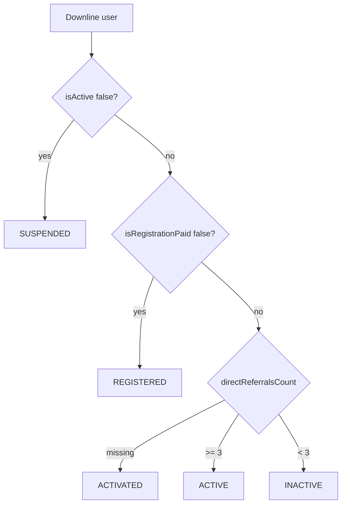

# Frontend Integration — Downline List (Package & MLM Status)

**Date:** 2026-06-17  
**Status:** **Shipped** on `GET /referrals/me/downlines`  
**Audience:** User app — Network / Downline List (`/network/downlines`)

Related:

- [API-downlines-requirements.md](../Febugs/API-downlines-requirements.md) — original field requirements
- [BACKEND_UPDATE_USER_MANAGEMENT (2).md](../Febugs/BACKEND_UPDATE_USER_MANAGEMENT%20(2).md) — same status rules as admin user management
- [frontend-integration-matrix-cpv-notifications.md](./frontend-integration-matrix-cpv-notifications.md) — matrix tree / flow (separate endpoints)

---

## 1. Summary

The downline list endpoint now returns each successline member’s **membership package** and **MLM management status** using the **same classification** as `GET /admin/users` (admin user management).

**Do not** derive status from `isActive` alone (`true`/`false`). Use the `status` enum from the API.

---

## 2. Endpoint

```
GET /referrals/me/downlines?depth={number}
Authorization: Bearer <token>
```

| Query | Required | Description |
|-------|----------|-------------|
| `depth` | No | Max tree depth to return (e.g. `2` = first two levels below you) |

**Response:** JSON array of downline items (not wrapped).

---

## 3. Response fields (per item)

| Field | Type | Use in UI |
|-------|------|-----------|
| `id` | uuid | Row key |
| `username` | string | Primary display name |
| `firstName`, `lastName`, `email` | string | Full name fallback |
| `level` | number | Tree depth relative to you (`1` = direct downline) |
| `registrationPackage` | `Package` enum | **Preferred** package badge |
| `package` | `Package` enum | Legacy alias — same value as `registrationPackage` |
| `status` | see below | **Status badge** (successline classification) |
| `isActive` | boolean | Account enabled flag only — **not** MLM active/inactive |
| `isRegistrationPaid` | boolean | Optional secondary badge / tooltip |
| `directReferralsCount` | number | Users who signed up with this member as referrer |
| `directReferrals` | number | Same as `directReferralsCount` (backward compatible) |
| `teamSize` | number | Total descendants in returned tree under this member |
| `rank` | string | e.g. `MENTOR`, `STAKEHOLDER` |
| `stage` | string | e.g. `Stage 1, Level 1` |
| `isDirectReferral` | boolean | `true` if they used **your** referral code (`referredById === you`) |
| `createdAt` | ISO string | Join date |
| `profilePhotoUrl` | string? | Avatar |

---

## 4. `status` values (MLM management)

Same rules as admin user management (`ACTIVE` threshold = **3** direct referrals):

| `status` | Meaning | Suggested UI label |
|----------|---------|-------------------|
| `SUSPENDED` | Account disabled by admin | Suspended |
| `REGISTERED` | Signed up, registration **not** paid | Registered |
| `ACTIVATED` | Paid; DR count missing (legacy migration) | Activated |
| `ACTIVE` | Paid + **≥ 3** direct referrals | Active |
| `INACTIVE` | Paid + **&lt; 3** direct referrals | Inactive |

### Decision flow (reference — backend computes this)



**Important:** `directReferralsCount` counts users with `referredById = this member` (sponsor link), **not** matrix placement children. This matches admin `GET /admin/users`.

---

## 5. Example response

```json
[
  {
    "id": "c9470d1e-fae5-4110-88a2-7b1b8f62bb66",
    "username": "johndoe",
    "email": "john@example.com",
    "firstName": "John",
    "lastName": "Doe",
    "level": 1,
    "registrationPackage": "GOLD",
    "package": "GOLD",
    "status": "INACTIVE",
    "isActive": true,
    "isRegistrationPaid": true,
    "directReferralsCount": 2,
    "directReferrals": 2,
    "teamSize": 8,
    "rank": "MENTOR",
    "stage": "Stage 1, Level 1",
    "isDirectReferral": true,
    "createdAt": "2025-01-15T10:30:00.000Z",
    "profilePhotoUrl": "https://cdn.example.com/avatars/john.jpg"
  }
]
```

---

## 6. Suggested frontend wiring

### TypeScript

```typescript
type DownlineManagementStatus =
  | 'SUSPENDED'
  | 'REGISTERED'
  | 'ACTIVATED'
  | 'ACTIVE'
  | 'INACTIVE';

type DownlineItem = {
  id: string;
  username: string;
  email: string;
  firstName: string;
  lastName: string;
  level: number;
  registrationPackage: string;
  package: string;
  status: DownlineManagementStatus;
  isActive: boolean;
  isRegistrationPaid: boolean;
  directReferralsCount: number;
  directReferrals: number;
  teamSize: number;
  rank: string;
  stage: string;
  isDirectReferral: boolean;
  createdAt: string;
  profilePhotoUrl?: string;
};

async function getMyDownlines(depth?: number): Promise<DownlineItem[]> {
  const params = depth != null ? `?depth=${depth}` : '';
  return api.get<DownlineItem[]>(`/referrals/me/downlines${params}`);
}
```

### Status badge

```typescript
const STATUS_LABEL: Record<DownlineManagementStatus, string> = {
  SUSPENDED: 'Suspended',
  REGISTERED: 'Registered',
  ACTIVATED: 'Activated',
  ACTIVE: 'Active',
  INACTIVE: 'Inactive',
};

// Prefer API status — do NOT map from isActive alone
function displayStatus(row: DownlineItem): string {
  return STATUS_LABEL[row.status] ?? row.status;
}
```

### Package badge

```typescript
const pkg = row.registrationPackage ?? row.package;
```

### Migration from old UI

| Old approach | New approach |
|--------------|--------------|
| `isActive ? 'Active' : 'Inactive'` | Use `row.status` |
| `status === 'active' \| 'inactive'` | Use `ACTIVE` / `INACTIVE` / etc. |
| Infer package from missing field | `registrationPackage` or `package` |
| Matrix-child count for DR column | `directReferralsCount` / `directReferrals` |

---

## 7. Filtering & sorting (client-side)

The API returns a flat array; apply filters in the UI:

- **By level:** `row.level === n`
- **By status:** `row.status === 'ACTIVE'`
- **Direct referrals only:** `row.isDirectReferral === true`
- **By package:** `row.registrationPackage === 'GOLD'`

---

## 8. Changelog

| Date | Change |
|------|--------|
| 2026-06-17 | Shipped `registrationPackage`, `status`, `isRegistrationPaid`, `directReferralsCount`; `directReferrals` aligned to sponsor DR count |
