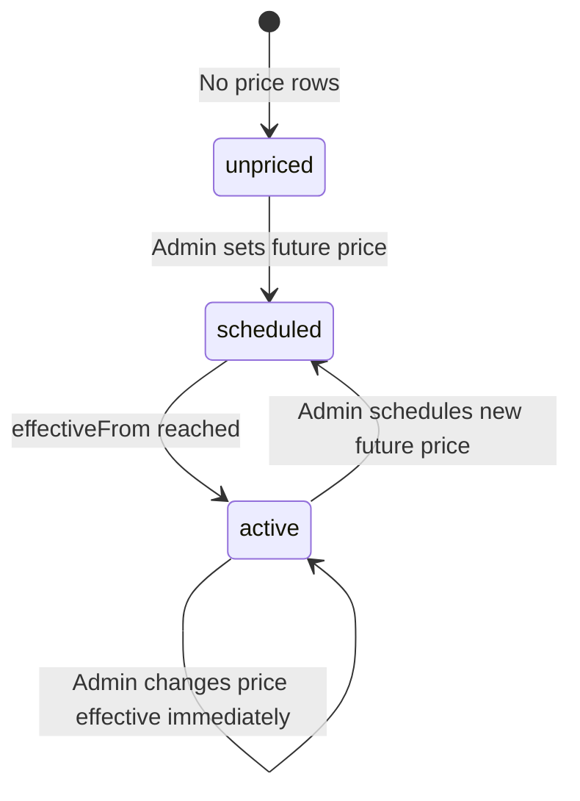

# Frontend Integration — Scheduled Product Pricing & Marketplace Availability

**Date:** 2026-06-17  
**Status:** **Shipped** — admin pricing display + marketplace `purchasable` / `availableFrom` / `priceStatus` fields  
**Audience:** User app marketplace, product detail, cart/checkout; admin product catalog

Related:

- [Product volume distribution](./frontend-integration-product-volume-distribution.md) — `pv` / `cpv` on prices
- [Admin product stock](./frontend-integration-admin-product-stock.md) — inventory metrics (separate from price scheduling)
- [Feature 12 — Product catalog](../features/12-product-catalog.md)

---

## 1. Summary

Admins can schedule a product price with a future `effectiveFrom` (e.g. **30 June 2026**). The desired marketplace behavior:

| Phase | Marketplace | Purchase |
|-------|-------------|----------|
| Before effective date | Product **visible** (if `ACTIVE`), shows scheduled price, tagged **not available** | **Blocked** |
| On/after effective date | Product visible, shows active price | **Allowed** (subject to stock) |

The backend will expose explicit flags so the frontend does not need to guess from `currentPrice: null`.

**Already shipped (admin):**

- `GET /admin/products`, `GET /admin/products/:id`, `PUT /admin/products/:id` return scheduled price fields when no price is effective yet.

**Shipped (marketplace):**

- `purchasable`, `availableFrom`, `priceStatus` on `GET /products`, `GET /products/:id`, `GET /public/products`, `GET /public/products/:id`
- Activation allowed when only a scheduled price exists (`PUT /admin/products/:id/status` → `ACTIVE`)

---

## 2. Endpoints affected

| Method | Path | Auth | Change |
|--------|------|------|--------|
| `GET` | `/products` | Bearer (member) | New fields + scheduled `currentPrice` |
| `GET` | `/products/:id` | Bearer (member) | Same; no longer errors when only scheduled price |
| `GET` | `/public/products` | None | Same as `/products` |
| `GET` | `/public/products/:id` | None | Same as `/products/:id` |
| `POST` | `/orders` (and checkout flows) | Bearer | **Unchanged** — rejects if no effective price |
| `PUT` | `/admin/products/:id/status` | Admin | Allows `ACTIVE` with scheduled-only price |

Admin list/detail pricing: **no further frontend work required** beyond removing temporary fallbacks once marketplace API is live.

---

## 3. New response fields

Present on **each catalog item** (list) and **product detail** (single):

| Field | Type | Description |
|-------|------|-------------|
| `purchasable` | `boolean` | `true` only when a price is in effect **right now**. Use to enable/disable add-to-cart. |
| `availableFrom` | `string \| null` | ISO-8601 datetime. Set when `purchasable === false` and a scheduled price exists. `null` otherwise. |
| `priceStatus` | `"active" \| "scheduled" \| "unpriced"` | UI badge / logic helper. |

### `priceStatus` meanings

| Value | When | Suggested UI |
|-------|------|--------------|
| `active` | Price effective now | Normal product card; enable purchase if in stock |
| `scheduled` | Future price exists, none effective yet | Show price + **“Available from &lt;date&gt;”** or **“Out of stock”** tag (product choice); disable cart |
| `unpriced` | No current or scheduled price | Hide from marketplace or show “Unavailable”; disable cart |

---

## 4. `currentPrice` semantics (updated)

The `currentPrice` object shape is **unchanged**; only **when it is populated** changes.

### Active price (`priceStatus: "active"`)

```json
{
  "purchasable": true,
  "availableFrom": null,
  "priceStatus": "active",
  "currentPrice": {
    "id": "price-uuid",
    "basePrice": 6.67,
    "nonMemberBasePrice": 10,
    "memberPriceNGN": 10000,
    "nonMemberPriceNGN": 15000,
    "pv": 3,
    "directReferralPv": 0,
    "cpv": 1.5,
    "effectiveFrom": "2026-06-01T00:00:00.000Z"
  }
}
```

### Scheduled price only (`priceStatus: "scheduled"`)

```json
{
  "id": "b40217bf-0f0a-4c2d-905d-2d9b7c1910e2",
  "name": "Segulah Herbal Wine",
  "sku": "WINE-001",
  "status": "ACTIVE",
  "purchasable": false,
  "availableFrom": "2026-06-30T00:00:00.000Z",
  "priceStatus": "scheduled",
  "currentPrice": {
    "id": "price-uuid",
    "basePrice": 6.67,
    "nonMemberBasePrice": 10,
    "memberPriceNGN": 10000,
    "nonMemberPriceNGN": 15000,
    "pv": 3,
    "directReferralPv": 0,
    "cpv": 1.5,
    "effectiveFrom": "2026-06-30T00:00:00.000Z"
  },
  "images": []
}
```

- Display the **scheduled** amounts so users know the upcoming price.
- `effectiveFrom` on `currentPrice` matches `availableFrom`.
- **Do not** allow add-to-cart while `purchasable === false`.

### No price (`priceStatus: "unpriced"`)

```json
{
  "purchasable": false,
  "availableFrom": null,
  "priceStatus": "unpriced",
  "currentPrice": null
}
```

---

## 5. Catalog list example

**`GET /products?limit=20&offset=0`**

```json
{
  "items": [
    {
      "id": "product-uuid",
      "name": "Segulah Herbal Wine",
      "description": "...",
      "sku": "WINE-001",
      "category": { "id": "...", "name": "Wine", "slug": "wine" },
      "status": "ACTIVE",
      "purchasable": false,
      "availableFrom": "2026-06-30T00:00:00.000Z",
      "priceStatus": "scheduled",
      "currentPrice": {
        "id": "price-uuid",
        "memberPriceNGN": 10000,
        "nonMemberPriceNGN": 15000,
        "pv": 3,
        "cpv": 1.5,
        "effectiveFrom": "2026-06-30T00:00:00.000Z"
      },
      "images": [{ "id": "...", "url": "...", "position": 0 }]
    }
  ],
  "total": 1,
  "limit": 20,
  "offset": 0
}
```

Public catalog (`GET /public/products`) returns the **same item shape** (non-member pricing via `nonMemberPriceNGN` for guests).

---

## 6. Frontend implementation guide

### 6.1 Marketplace product card

```typescript
function getAvailabilityBadge(product: CatalogProduct) {
  if (product.priceStatus === 'scheduled' && product.availableFrom) {
    return {
      label: 'Out of stock', // or "Available soon" — product copy decision
      sublabel: formatDate(product.availableFrom),
      variant: 'warning' as const,
    };
  }
  if (!product.purchasable) {
    return { label: 'Unavailable', variant: 'muted' as const };
  }
  return null;
}

function canAddToCart(product: CatalogProduct) {
  return product.purchasable && product.status === 'ACTIVE';
}
```

**Recommended rules:**

1. Show product in grid when `status === 'ACTIVE'` (existing visibility rules unchanged).
2. If `priceStatus === 'scheduled'`: show scheduled `currentPrice` amounts and an **out of stock / available from** badge using `availableFrom`.
3. Disable **Add to cart** when `purchasable === false` (do not rely on `currentPrice === null` alone).
4. When `priceStatus === 'active'`, use existing in-stock logic (merchant pool, etc.).

### 6.2 Product detail page

- Render name, images, description as today.
- Price block: use `currentPrice.memberPriceNGN` / `nonMemberPriceNGN` even when scheduled (preview pricing).
- Primary CTA:
  - `purchasable === true` → “Add to cart” / “Buy now”
  - `priceStatus === 'scheduled'` → disabled button, e.g. **“Available from 30 Jun 2026”**
  - `priceStatus === 'unpriced'` → “Unavailable”

**Migration:** Remove any client-side workaround that treats `currentPrice: null` as a hard error on detail load.

### 6.3 Cart and checkout

- **Client:** Never add items with `purchasable === false` to cart.
- **Server:** Order creation still validates effective price. If a user bypasses the UI, expect:

```json
{
  "statusCode": 400,
  "message": "Product Segulah Herbal Wine has no active price"
}
```

Show a toast: *“This product is not available for purchase yet.”*

### 6.4 Admin product workflow

1. Create product (DRAFT).
2. `POST /admin/products/:id/price` with `effectiveFrom` in the future.
3. `PUT /admin/products/:id/status` → `{ "status": "ACTIVE" }`  
   - **After backend update:** succeeds with scheduled-only price.  
   - **Before backend update:** fails with *“Product must have an active price before activation”*.
4. Product appears on marketplace with `priceStatus: "scheduled"`.
5. On effective date, catalog automatically returns `purchasable: true` — **no admin action required**.

**Remove temporary admin fallbacks** (once marketplace API is deployed):

| Workaround | Replace with |
|------------|--------------|
| Preserve price in local state after `PUT` overwrites to null | Trust `PUT` / `GET` admin responses (already fixed) |
| Fetch `GET /admin/products/:id/price-history` when pricing is null | Trust `GET /admin/products/:id` `currentPrice` |

### 6.5 Date display

- Parse `availableFrom` and `currentPrice.effectiveFrom` as UTC ISO strings.
- Format in the user’s locale, e.g. `30 June 2026`.
- Optional countdown is frontend-only; backend does not send TTL fields.

### 6.6 TypeScript types (suggested)

```typescript
type ProductPriceStatus = 'active' | 'scheduled' | 'unpriced';

interface CatalogProductPrice {
  id: string;
  basePrice: number;
  nonMemberBasePrice: number;
  memberPriceNGN: number;
  nonMemberPriceNGN: number;
  pv: number;
  directReferralPv: number;
  cpv: number;
  effectiveFrom: string;
}

interface CatalogProduct {
  id: string;
  name: string;
  description?: string | null;
  sku: string;
  status: string;
  purchasable: boolean;
  availableFrom: string | null;
  priceStatus: ProductPriceStatus;
  currentPrice: CatalogProductPrice | null;
  images: Array<{ id: string; url: string; altText?: string | null; position: number }>;
  category?: { id: string; name: string; slug: string };
}
```

---

## 7. State transition reference



| Transition | `purchasable` | `priceStatus` | Frontend action |
|------------|---------------|---------------|-----------------|
| DRAFT → ACTIVE (scheduled price) | `false` | `scheduled` | Show on marketplace, disable cart |
| Clock passes `availableFrom` | `true` | `active` | Enable cart on next catalog fetch |
| Admin immediate price change | `true` | `active` | No special handling |

---

## 8. Testing checklist (frontend QA)

- [ ] Scheduled product appears in marketplace list while `purchasable === false`
- [ ] Card shows scheduled price and “out of stock” / “available from” badge
- [ ] Detail page loads without error for scheduled-only product
- [ ] Add to cart disabled; cannot add via devtools without API success
- [ ] Checkout returns 400 with friendly message if purchase attempted early
- [ ] After effective date (or mocked clock), product becomes purchasable without redeploy
- [ ] Admin can activate product with only scheduled price
- [ ] Admin edit form shows scheduled price without price-history fallback

---

## 9. Out of scope

- **Inventory / warehouse stock** — `purchasable` refers to **price availability**, not physical stock. Continue using stock/pool APIs for true stock-out.
- **Auto-refresh at midnight** — frontend should refetch catalog on navigation or use polling; backend does not push WebSocket events for price activation.
- **Timezone selection for `effectiveFrom`** — stored and compared in UTC; display localized in UI.

---

## 10. Changelog

| Date | Change |
|------|--------|
| 2026-06-17 | Marketplace `purchasable` / `availableFrom` / `priceStatus` shipped on catalog endpoints |
| 2026-06-17 | Initial doc; admin pricing null fix shipped |
